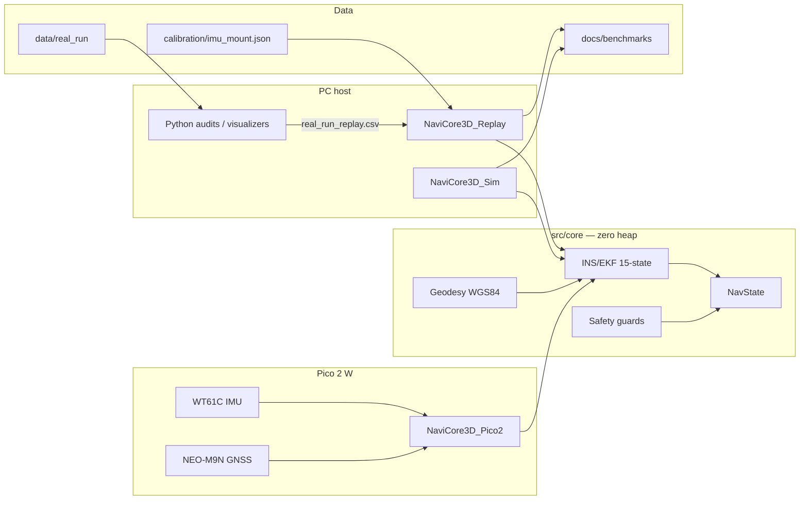

# NaviCore-3D: Multi-Domain Ultra-Low Power Navigation Core

```cpp
// Haiku del Programador Defensivo en C++
//
//   Sin heap en el tick —
//   static_assert al amanecer:
//   parada segura.
```

**ES** · Núcleo de navegación unificado multimodal (tierra, aire, mar) para **edge computing** en MCUs de ultra-bajo consumo, con motor **INS/EKF de 15 estados**, simulador PC, replay de datos reales y target Pico 2 W.  
**EN** · Unified multi-domain navigation core (land, air, sea) for **edge** ultra-low-power MCUs, with a **15-state INS/EKF**, PC simulator, real-run replay, and Pico 2 W target.

---

## Contents / Contenido

1. [Quick start (local)](#quick-start-local)
2. [Executive summary](#executive-summary--resumen-ejecutivo)
3. [Repository layout](#repository-layout--estructura)
4. [Architecture](#architecture--arquitectura)
5. [Build](#build--compilar)
6. [Run simulator](#run-simulator--ejecutar-simulador)
7. [Real-run replay pipeline](#real-run-replay-pipeline)
8. [EKF diagnostics (H0–H9d, GAP-1…5)](#ekf-diagnostics-real-run)
9. [Calibration](#calibration--calibración)
10. [Python tooling](#python-tooling)
11. [Validated stress scenarios](#validated-stress-scenarios)
12. [Digital Twin / telemetry](#digital-twin--telemetry)
13. [Roadmap](#roadmap)
14. [License](#license--author)

---

## Quick start (local)

Requisitos mínimos en PC:

| Tool | Version |
|------|---------|
| CMake | ≥ 3.15 |
| C++ compiler | C++17 (MinGW, MSVC, or Clang) |
| Python | ≥ 3.10 (replay / audits / visualizers) |
| pip packages | `numpy`, `matplotlib`, `pandas` |

```powershell
# 1) Clone / open repo
cd C:\NaviCore-3D

# 2) Python deps (visualizers + GAP audits)
pip install numpy matplotlib pandas

# 3) Configure + build all PC targets
cmake -S . -B build -G "MinGW Makefiles" -DCMAKE_BUILD_TYPE=Release
cmake --build build

# 4) Smoke: stress simulator (writes docs\telemetria_navicore.csv)
.\build\NaviCore3D_Sim.exe --no-udp

# 5) Smoke: regression
.\build\navicore_regression_test.exe
# or orchestrated:
python tools\run_regression_suite.py
```

Real-run EKF replay (datos en `data/real_run/`):

```powershell
python parse_mobile_log.py --input-dir data\real_run --output docs\benchmarks\real_run_replay.csv
cmake --build build --target NaviCore3D_Replay
.\build\NaviCore3D_Replay.exe --help
```

Documentación de reproducción completa: [`docs/diagnostics/06-reproduction.md`](docs/diagnostics/06-reproduction.md).

---

## Executive Summary / Resumen ejecutivo

| | **English** | **Español** |
|---|---|---|
| **Mission** | Single navigation state across domains, with dead reckoning when GNSS fails, on bare-metal MCUs (Pico 2 W validated in Comarruga lab). | Modelo único de estado de navegación en todos los dominios, con navegación estimada cuando falla el GNSS, en MCUs bare-metal (Pico 2 W validado en banco Comarruga). |
| **Estimator** | 15-state error-state INS/EKF (position, velocity, attitude error, accel/gyro biases) @ 100 Hz. | INS/EKF de 15 estados (posición, velocidad, error de actitud, sesgos accel/giro) @ 100 Hz. |
| **Language** | C++17, embedded-oriented: fixed structs, no heap in `core/`. | C++17, estilo embebido: estructuras fijas, sin heap en `core/`. |
| **Memory** | **Zero dynamic allocation** in `core/`: no `std::vector`, no `std::string`, fixed buffers, stack-only hot paths. | **Cero asignación dinámica** en `core/`: sin `std::vector`/`std::string`, buffers fijos, hot path en stack. |
| **Frames** | Nav: **NED**. Body: **FRD** (+X forward, +Y right, +Z down). Quaternions: Hamilton. | Nav: **NED**. Cuerpo: **FRD**. Cuaterniones: Hamilton. |
| **Coordinates (NavState API)** | Permanent 3D axes: **X = latitude**, **Y = longitude**, **Z = altitude (air) / hydrostatic pressure (sea)**. | Ejes 3D permanentes: **X = latitud**, **Y = longitud**, **Z = altitud / presión hidrostática**. |
| **Host modes** | (1) Synthetic stress sim `NaviCore3D_Sim`. (2) Real vehicle replay `NaviCore3D_Replay`. | (1) Simulador de estrés. (2) Replay de vehículo real. |

---

## Repository layout / Estructura

```
NaviCore-3D/
├── src/
│   ├── core/                      # Motor universal (EKF, geodesia, fusion, guards)
│   ├── scenarios/                 # TUNNEL_STRESS, SLALOM
│   └── targets/
│       ├── generic_pc/            # Sim, VehicleDemo, Replay, benchmarks
│       └── pico2_hardware/        # Pico 2 W @ 100 Hz (banco Comarruga)
├── data/
│   └── real_run/                  # CSVs Android Sensor Logger (~332 s)
├── calibration/
│   └── imu_mount.json             # Matriz sensor→body FRD (Rodrigues)
├── docs/
│   ├── diagnostics/               # Metodología H0–H9d + GAP-1…5
│   ├── benchmarks/                # Artefactos CSV/JSON/PNG de experimentos
│   ├── monte_carlo/               # Trazas Monte Carlo
│   ├── nhc_experiments/           # Experimentos NHC del sim
│   ├── comarruga_lab_hardware.md  # Hardware lab Pico 2 W
│   ├── sil_architecture.md        # SIL multi-UAV
│   └── telemetria_navicore.csv    # Black-box del simulador
├── tools/                         # Visualizers, regression, GAP auditors/runners
├── parse_mobile_log.py            # Sensor Logger → replay CSV
├── audit_imu_chain.py             # Cadena IMU + export calibración
├── CMakeLists.txt                 # Build PC
├── DEVELOPMENT.md                 # Contexto vivo para agentes / desarrollo
├── README.md
└── build/                         # Salida CMake local (no versionar)
```

| Path | Role |
|------|------|
| `src/core/` | INS/EKF 15-state, NavState, geodesy WGS84, fusion/DR, cortex, safety guards |
| `src/scenarios/` | Escenarios cuantitativos (`tunnel_stress`, `slalom_scenario`) |
| `src/targets/generic_pc/` | Host: sim, replay, UDP telemetry, adaptive NHC controller |
| `src/targets/pico2_hardware/` | Embedded: BSP IMU/GNSS/UPS, health monitor, WDT |
| `data/real_run/` | Entrada cruda del vehículo (Android Sensor Logger) |
| `docs/benchmarks/` | Salidas de auditoría y benchmarks |
| `docs/diagnostics/` | Documentación científica del pipeline EKF |
| `tools/` | Scripts Python de visualización, regresión y GAP |
| `calibration/` | Calibración de montaje IMU |

Contexto de desarrollo y prioridades RT: [`DEVELOPMENT.md`](DEVELOPMENT.md).

---

## Architecture / Arquitectura



**NavState** is the single source of truth for the guidance/API layer: position, velocity, heading, mode (`GPS` · `DEAD_RECKONING` · `HYBRID`), and confidence (`estimate_quality`, satellite count, fix age).

**INS/EKF** (primary estimator for real-run work) integrates specific force and angular rate in the body frame, transforms to NED, and applies GNSS / NHC / ZUPT updates with NIS gating (Joseph form covariance update).

Body-frame contract (normative): [`docs/diagnostics/08-body-frame-contract.md`](docs/diagnostics/08-body-frame-contract.md).

---

## Build / Compilar

### PC targets (root `CMakeLists.txt`)

```powershell
cmake -S . -B build -G "MinGW Makefiles" -DCMAKE_BUILD_TYPE=Release
cmake --build build
```

| Target | Binary | Description |
|--------|--------|-------------|
| `NaviCore3D_Sim` | `build\NaviCore3D_Sim.exe` | Stress simulator + CSV/UDP telemetry |
| `NaviCore3D_VehicleDemo` | `build\NaviCore3D_VehicleDemo.exe` | CAN vehicle-bus demo + HMI |
| `NaviCore3D_Replay` | `build\NaviCore3D_Replay.exe` | Real-run EKF replay + audit hooks |
| `navicore_regression_test` | `build\navicore_regression_test.exe` | C++ regression suite |
| `ring_stress_test` | `build\ring_stress_test.exe` | Host SPSC UART stress (S7 campaign) |

Build a single target:

```powershell
cmake --build build --target NaviCore3D_Replay
cmake --build build --target NaviCore3D_Sim
```

On Windows, the sim links `ws2_32` for UDP telemetry.

### Pico 2 W (`NaviCore3D_Pico2`)

Requires [Pico SDK](https://github.com/raspberrypi/pico-sdk) and Ninja:

```powershell
$env:PICO_SDK_PATH = 'C:\path\to\pico-sdk'
cmake -S src\targets\pico2_hardware -B build_pico2 -G Ninja
cmake --build build_pico2
```

Copy `src/targets/pico2_hardware/wifi_config.h.example` → `wifi_config.h` before building Wi-Fi features.

Hardware notes: [`docs/comarruga_lab_hardware.md`](docs/comarruga_lab_hardware.md).  
Validated lab release tag: `pico2-comarruga-banco-v1`.

---

## Run simulator / Ejecutar simulador

```powershell
.\build\NaviCore3D_Sim.exe
```

| Flag | Effect |
|------|--------|
| `--no-udp` | Disable UDP telemetry (CI / headless) |
| `--run-tests` | Run embedded regression suite |
| `--scenario SLALOM` | Slalom tracking scenario |
| `--scenario TUNNEL_STRESS` | Multi-phase tunnel profile |
| `--super-tunnel` | NHC vs no-NHC comparison |
| `--nhc-experiments` | Super-tunnel NHC experiment matrix |
| `--stress` / `--high-stress` | WCET / radio-burst stress |
| `--clean` | Clean mission (no fault injection) |
| `--seed N` | RNG seed (default: system clock) |
| `--csv-out <path>` | Override telemetry CSV path |
| `--replay <csv>` | SiL replay from CSV |

Default black-box export: `docs/telemetria_navicore.csv`.

Vehicle bus demo:

```powershell
.\build\NaviCore3D_VehicleDemo.exe
```

Quantitative sim benchmarks:

```powershell
python run_all_benchmarks.py
```

Live / offline visualization:

```powershell
# Offline 3D CSV replay
python tools\visualizer.py

# Live UDP (run Sim in another terminal without --no-udp)
python tools\remote_visualizer.py
```

---

## Real-run replay pipeline

End-to-end flow for Android Sensor Logger captures:

```
data/real_run/*.csv
    → parse_mobile_log.py
    → docs/benchmarks/real_run_replay.csv
    → NaviCore3D_Replay.exe (+ calibration/imu_mount.json)
    → docs/benchmarks/*_output.csv / *_report.json / *.png
    → tools/audit_gap*.py  (scientific auditors)
```

### Input data (`data/real_run/`)

| File | Use |
|------|-----|
| `AccelerometerUncalibrated.csv` | **Primary IMU accel input** for replay |
| `Gyroscope.csv` | Gyro |
| `Location.csv` | GNSS lat/lon/alt, speed, bearing |
| `Orientation.csv` | Android attitude (external reference, not GT) |
| `Gravity.csv` | Android gravity estimate |
| `TotalAcceleration.csv` | Total acceleration |
| `Metadata.csv` | Recording metadata |
| `Accelerometer.csv` | Identity / audit only — **do not** feed as replay IMU |
| `Annotation.csv` | Optional annotations |

Short legacy capture archived under `docs/_archive_short_run_jul15/`.

### Prepare replay CSV

```powershell
python parse_mobile_log.py `
  --input-dir data\real_run `
  --output docs\benchmarks\real_run_replay.csv
```

### Example: H9 predict-only (60 s)

```powershell
.\build\NaviCore3D_Replay.exe `
  --input docs\benchmarks\real_run_replay.csv `
  --output docs\benchmarks\h9_predict_only_output.csv `
  --predict-only --predict-only-end-s 60 `
  --h9a-gravity-tilt-init `
  --mount-calibration calibration\imu_mount.json `
  --predict-audit-csv docs\benchmarks\h9_predict_only_audit.csv
```

### Example: scientific baseline (constraints explicit)

```powershell
.\build\NaviCore3D_Replay.exe `
  --input docs\benchmarks\real_run_replay.csv `
  --output docs\benchmarks\gap3_baseline_output.csv `
  --constraint-policy imu_stationary `
  --nhc-policy enabled `
  --nhc-every-n-ticks 1 `
  --mount-calibration calibration\imu_mount.json
```

### Important replay flags

| Flag | Values / purpose |
|------|------------------|
| `--input`, `--output` | Replay CSV paths |
| `--mount-mode` | `none`, `legacy`, `calibration` |
| `--mount-calibration` | Path to `imu_mount.json` |
| `--yaw-init` | `zero`, `gnss_stable`, `h3` |
| `--predict-only` | Disable GNSS/NHC/ZUPT updates |
| `--predict-only-end-s`, `--replay-end-s` | Time window |
| `--h9a-gravity-tilt-init` | Init roll/pitch from gravity |
| `--constraint-policy` | `auto`, `forced_time`, `gps_stop`, `imu_stationary`, `disabled` |
| `--nhc-policy` | `enabled`, `disabled` |
| `--nhc-every-n-ticks N` | NHC decimation |
| `--gnss-obs-mode` | `pos`, `pos_vel`, `vel_only` |
| `--p-pv-policy` | `none`, `gap_le_1s`, `zero`, `cos_pos`, `cos_tot` |
| `--adaptive-nhc` | `off`, `passive`, `active` |
| `--p0-scale`, `--q-scale`, `--nhc-sigma` | Covariance / NHC tuning |
| `--gap3-*-audit-csv` | GAP-3 audit exports |
| `--help` | Full CLI |

> **Validity note (Jul 2026):** full-filter runs between H9 and GAP-3.7 used legacy ZUPT (`forced_time`: `t≤30s OR gps_speed≤0.1`). Re-run with `--constraint-policy imu_stationary` before citing those results. Predict-only (H9) is unaffected. See [`docs/diagnostics/11-replay-zupt-provenance.md`](docs/diagnostics/11-replay-zupt-provenance.md).

---

## EKF diagnostics (real-run)

Pipeline experimental sobre grabaciones reales: consistencia NEES/NIS, geodesia WGS84, sincronización, propagación inercial, conformidad body-frame y auditorías GAP.

**Index:** [`docs/diagnostics/README.md`](docs/diagnostics/README.md)

### Document map

| Doc | Content |
|-----|---------|
| [01-overview](docs/diagnostics/01-overview.md) | Methodology, H0→H9d chain |
| [02-data-and-frames](docs/diagnostics/02-data-and-frames.md) | Data sources, frame chain |
| [03-experiments](docs/diagnostics/03-experiments.md) | Experiment catalog + scripts |
| [04-findings](docs/diagnostics/04-findings.md) | Consolidated results |
| [05-attitude-investigation](docs/diagnostics/05-attitude-investigation.md) | H9 attitude block |
| [06-reproduction](docs/diagnostics/06-reproduction.md) | **Build + reproduce all audits** |
| [07-signal-traceability](docs/diagnostics/07-signal-traceability.md) | Android → mount → EKF |
| [08-body-frame-contract](docs/diagnostics/08-body-frame-contract.md) | Formal body FRD contract |
| [09-predict-conformance-audit](docs/diagnostics/09-predict-conformance-audit.md) | predict() conformance + GAP-1/2 |
| [10-gap3-ins-model-audit](docs/diagnostics/10-gap3-ins-model-audit.md) | GAP-3 detailed audit |
| [11-replay-zupt-provenance](docs/diagnostics/11-replay-zupt-provenance.md) | Legacy ZUPT validity warning |
| [12-gap3-synthesis](docs/diagnostics/12-gap3-synthesis.md) | **GAP-3 closed synthesis** |
| [13-gap4-gnss-velocity-protocol](docs/diagnostics/13-gap4-gnss-velocity-protocol.md) | **GAP-4 diagnostic closed** |
| [14-adaptive-nhc-protocol](docs/diagnostics/14-adaptive-nhc-protocol.md) | GAP-5 v1 preregistration |
| [15-gap5-passive-outcome](docs/diagnostics/15-gap5-passive-outcome.md) | GAP-5 v1 passive outcome |
| [16-gap5-v2-observable-selection](docs/diagnostics/16-gap5-v2-observable-selection.md) | **GAP-5 v2 (active research)** |

Frozen reference set: [`docs/diagnostics/reference/`](docs/diagnostics/reference/)  
(`STATE_OF_KNOWLEDGE.md`, `OPEN_QUESTIONS.md`, `DECISION_LOG.md`, `RESEARCH_MAP.md`).

### Research status (Jul 2026)

| Phase | Question | Status |
|-------|----------|--------|
| **GAP-1** | Body FRD mount vs vehicle | **CLOSED** |
| **GAP-2** | Measured → NED dynamics | **CLOSED** |
| **GAP-3** | INS model autopsy (NHC / P / K / gate) | **CLOSED** |
| **GAP-4** | GNSS velocity / P_pv diagnostic | **CLOSED** (`gap4-diagnostic-complete`) |
| **GAP-5 v1** | Adaptive NHC via Γ̄ | **CLOSED** — passive controller inactive under preregistered operationalization |
| **GAP-5 v2** | Observable / regime selection | **PREREGISTERED** — characterization / benchmarks pending |

### Snapshot findings (attitude)

| Regime | EKF ↔ Orientation | EKF ↔ gravity | `a_lin,h` |
|--------|-------------------|---------------|-----------|
| Static 0–2 s | **0.05°** | **0.09°** | **0.016 m/s²** |
| Dynamic 2–10 s | **~4.1°** | **~4.3°** | **0.74 m/s²** |

### GAP tooling (`tools/`)

| Area | Scripts (examples) |
|------|--------------------|
| GAP-1 | `audit_gap1_delta_psi_constancy.py`, `audit_gap1_body_forward_axis.py` |
| GAP-2 | `audit_gap2_gravity_identity_tick.py`, `audit_gap2_specific_force_decomposition.py`, `audit_gap2_predict_chain_break.py` |
| GAP-3 | `run_gap3_constraint_matrix.py`, `run_gap3_f1_nhc_dose_response.py`, `audit_gap3_*.py` |
| GAP-4 | `run_gap4_*.py`, `audit_gap4_*.py`, `render_gap4_diagnostic_synthesis.py` |
| GAP-5 | `run_gap5_p0_passive_validation.py`, `audit_gap5_passive_controller_validation.py` |
| Support | `audit_body_frame_conformance.py`, `audit_android_signal_identity.py`, `audit_imu_chain.py` |

Artifacts land in `docs/benchmarks/` (and subfolders `gap3_*`, `gap4_gnss_velocity/`, `gap5_adaptive_nhc/`, `constraint_matrix/`, …).

---

## Calibration / Calibración

Primary mount calibration: [`calibration/imu_mount.json`](calibration/imu_mount.json)

- Method: gravity-alignment Rodrigues (`audit_imu_chain.py`)
- Maps sensor frame → vehicle body **FRD**
- Applied in replay via `--mount-calibration` / `--mount-mode calibration`

Regenerate:

```powershell
python audit_imu_chain.py --export-calibration calibration\imu_mount.json
```

---

## Python tooling

There is no `requirements.txt` yet; install the documented minimum:

```powershell
pip install numpy matplotlib pandas
```

| Script | Role |
|--------|------|
| `parse_mobile_log.py` | Sensor Logger folder → `real_run_replay.csv` |
| `audit_imu_chain.py` | IMU chain audit + mount export |
| `run_all_benchmarks.py` | Quantitative sim benchmarks |
| `tools/visualizer.py` | Offline 3D CSV replay |
| `tools/remote_visualizer.py` | Live UDP telemetry |
| `tools/run_regression_suite.py` | Regression orchestrator (`--full` includes ring stress) |
| `tools/audit_gap*.py` / `tools/run_gap*.py` | Scientific GAP campaign |
| Root `run_h*.py` | H-series experiment runners |

UDP protocol unit tests:

```powershell
python tools\test_udp_telemetry.py
```

---

## Validated stress scenarios

Both scenarios run in `NaviCore3D_Sim` at **100 ms** ticks and export every sample to the black-box CSV.

### 1 · GPS Loss (Air / Land)

| | |
|---|---|
| **Setup** | Cruise at **15 m/s**, heading **90°**, **8 satellites** with valid fix. |
| **Event** | At **t = 5 s**, satellites drop to **0** for **10 s**; GNSS updates stop. |
| **Expected** | Mode → **`DEAD_RECKONING`**; `estimate_quality` degrades with `fix_age_ms`; recovery at **t = 15 s**. |
| **Result** | Quality drops **0.790 → 0.295** during outage; full GNSS recovery after restore. |

### 2 · Submarine Immersion

| | |
|---|---|
| **Setup** | Domain **SEA**, no GNSS; hydrostatic pressure rises at **+10 000 Pa/s**. |
| **Expected** | `Pos_Z` tracks pressure in Pa; `Vel_Z` ≈ **10 000 Pa/s** after first sample. |
| **Result** | `pos.z` reaches **201 325 Pa** at 10 s; `vel.z` stable at **10 000 Pa/s**. |

Additional quantitative scenarios: `SLALOM`, `TUNNEL_STRESS`, `--super-tunnel`, `--nhc-experiments`.

---

## Digital Twin / Telemetry

### Live System Telemetry Mockup

Representación estática del frame UART / consola del simulador (`NaviCore3D_Sim`) a **100 ms** — valores ilustrativos del escenario de crucero nominal.

```
╔══════════════════════════════════════════════════════════════════════════════╗
║  NAVICORE-3D · LIVE INERTIAL DASHBOARD          tick=050  t=5.00s  Δt=100ms ║
╠══════════════════════════════════════════════════════════════════════════════╣
║  MODE ████░░░░  HYBRID          HEALTH ███████░░  NOMINAL (85)               ║
║  POWER PERFORMANCE              SHUTDOWN ░ latched=0                         ║
╠══════════════════════════════╦═══════════════════════════════════════════════╣
║  ATTITUDE (deg)              ║  VELOCITY (m/s)                                ║
║  ┌─ heading ─────────────┐   ║  N (Vel_X)  +15.000    E (Vel_Y)   +0.000     ║
║  │         N             │   ║  Z (Vel_Z)   +0.000    |V|         15.00      ║
║  │    W ───●─── E  90.0° │   ╠═══════════════════════════════════════════════╣
║  │         S             │   ║  POSITION                                     ║
║  └───────────────────────┘   ║  Lat (X)  41.387402°   Lon (Y)    2.168611°   ║
╠══════════════════════════════╣  Alt (Z)  12.00 m      Quality     0.850      ║
║  IMU (body frame)            ║  GNSS sats  17         fix_age     120 ms     ║
║  ax  +0.02   ay  +0.00       ╠═══════════════════════════════════════════════╣
║  az  +9.81   gx  +0.00       ║  GUARDS (last tick)                           ║
║  gy  +0.00   gz  +0.00       ║  WCET ok   GEOM ok   DIV ok   SLIP ok         ║
╠══════════════════════════════╩═══════════════════════════════════════════════╣
║  CROSS_TRACK   +0.4 m    ALONG_TRACK  14.1 m    WP queue  3/64    BSP IDLE    ║
╚══════════════════════════════════════════════════════════════════════════════╝
```

### Black-box CSV

**File:** `docs/telemetria_navicore.csv` (rewritten each sim run)

| Column | Description |
|--------|-------------|
| `Timestamp_ms` | Simulation time [ms] |
| `Escenario` | `GPS_LOSS` or `SUBMARINE` |
| `Modo` | `GPS` · `DEAD_RECKONING` · `HYBRID` · `INITIALIZING` |
| `Calidad` | Confidence score 0.0 – 1.0 |
| `Satelites` | Scenario satellite count |
| `Pos_X` · `Pos_Y` · `Pos_Z` | Unified 3D position (lat °, lon °, alt m or Pa) |
| `Vel_X` · `Vel_Y` · `Vel_Z` | Velocity (m/s or Pa/s) |
| `Rumbo` | Heading [°] |

Export uses **`fprintf`** — no dynamic allocations inside the simulation loop. Suitable as a reference pattern for SD-card logging on target hardware.

UDP telemetry v3 (32-byte frames) feeds `tools/remote_visualizer.py` for live HIL-style visualization.

**Next step for the twin:** ingest CSV → time-series store → 3D scene (Cesium / Unity / Unreal) with mode/confidence colour coding.

SIL architecture notes: [`docs/sil_architecture.md`](docs/sil_architecture.md).

---

## Roadmap

| Phase | Target |
|-------|--------|
| **Done** | PC simulator + CSV black box + zero-heap fusion/EKF core |
| **Done** | `pico2_hardware` — Pico 2 W @ 100 Hz, banco Comarruga (`pico2-comarruga-banco-v1`) |
| **Done** | Real-run diagnostic pipeline H0–H9d + GAP-1…4 closed; GAP-5 v1 closed |
| **Now** | GAP-5 v2 observable / regime characterization |
| **Next** | Campaña WCET S0–S7 + telemetría UDP en vivo desde `NaviCore3D_Pico2` |
| **Twin** | Live telemetry → Digital Twin 3D dashboard |

---

## License & Author

**Author:** Juan Carlos Pulido Mellado  
**License:** [MIT License](LICENSE) — Copyright (c) 2026 Juan Carlos Pulido Mellado

Private / showcase repository.  
**NaviCore-3D** — *Navigate every domain. Trust every fix. Zero waste on the edge.*
