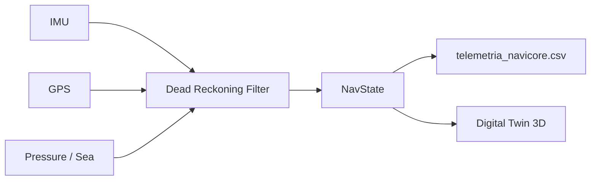

# NaviCore-3D: Multi-Domain Ultra-Low Power Navigation Core

```cpp
// Haiku del Programador Defensivo en C++
//
//   Sin heap en el tick —
//   static_assert al amanecer:
//   parada segura.
```

**ES** · Núcleo de navegación unificado multimodal (tierra, aire, mar) diseñado para **edge computing** en microcontroladores de ultra-bajo consumo.  
**EN** · Unified multi-domain navigation core (land, air, sea) built for **edge computing** on ultra-low-power microcontrollers.

---

## Live System Telemetry Mockup

Representación estática del frame UART / consola del simulador (`NaviCore3D_Sim`) a **100 ms** — valores ilustrativos del escenario de crucero nominal.

```
╔══════════════════════════════════════════════════════════════════════════════╗
║  NAVICORE-3D · LIVE INERTIAL DASHBOARD          tick=050  t=5.00s  Δt=100ms ║
╠══════════════════════════════════════════════════════════════════════════════╣
║  MODE ████░░░░  HYBRID          HEALTH ███████░░  NOMINAL (85)               ║
║  POWER PERFORMANCE              SHUTDOWN ░ latched=0                         ║
╠══════════════════════════════╦═══════════════════════════════════════════════╣
║  ATTITUDE (deg)              ║  VELOCITY (m/s)                                ║
║  ┌─ heading ─────────────┐   ║  N (Vel_X)  +15.000    E (Vel_Y)   +0.000     ║
║  │         N             │   ║  Z (Vel_Z)   +0.000    |V|         15.00      ║
║  │    W ───●─── E  90.0° │   ╠═══════════════════════════════════════════════╣
║  │         S             │   ║  POSITION                                     ║
║  └───────────────────────┘   ║  Lat (X)  41.387402°   Lon (Y)    2.168611°   ║
╠══════════════════════════════╣  Alt (Z)  12.00 m      Quality     0.850      ║
║  IMU (body frame)            ║  GNSS sats  17         fix_age     120 ms     ║
║  ax  +0.02   ay  +0.00       ╠═══════════════════════════════════════════════╣
║  az  +9.81   gx  +0.00       ║  GUARDS (last tick)                           ║
║  gy  +0.00   gz  +0.00       ║  WCET ok   GEOM ok   DIV ok   SLIP ok         ║
╠══════════════════════════════╩═══════════════════════════════════════════════╣
║  CROSS_TRACK   +0.4 m    ALONG_TRACK  14.1 m    WP queue  3/64    BSP IDLE    ║
╚══════════════════════════════════════════════════════════════════════════════╝
```

> **Black-box export:** cada fila del mockup se vuelca a `docs/telemetria_navicore.csv` para replay offline y Gemelo Digital 3D.

---
## Executive Summary / Resumen ejecutivo

| | **English** | **Español** |
|---|---|---|
| **Mission** | Provide a single navigation state model across domains, with dead reckoning when GNSS fails, on bare-metal MCUs (Pico 2 W validated in Comarruga lab). | Ofrecer un modelo único de estado de navegación en todos los dominios, con navegación estimada cuando falla el GNSS, en MCUs bare-metal (Pico 2 W validado en banco Comarruga). |
| **Language** | C++17 (PC simulator), embedded-oriented style: fixed structs, no heap. | C++17 (simulador PC), estilo embebido: estructuras fijas, sin heap. |
| **Memory** | **Zero dynamic allocation** in `core/` and `fusion/`: no `std::vector`, no `std::string`, fixed waypoint buffers, stack-only data paths. | **Cero asignación dinámica** en `core/` y `fusion/`: sin `std::vector`, sin `std::string`, buffers fijos, datos en stack. |
| **Math** | `sqrtf` / `sinf` / `cosf` with motion thresholds — skip redundant FPU work when the vehicle is stationary. | `sqrtf` / `sinf` / `cosf` con umbrales de movimiento — se evita trabajo FPU redundante con el vehículo parado. |
| **Coordinates** | Permanent 3D axes: **X = latitude**, **Y = longitude**, **Z = altitude (air) / hydrostatic pressure (sea)**. | Ejes 3D permanentes: **X = latitud**, **Y = longitud**, **Z = altitud (aire) / presión hidrostática (mar)**. |

---

## Architecture / Arquitectura

```
NaviCore-3D/
├── src/
│   ├── core/                   # Universal math engine (target-agnostic)
│   │   ├── NavState.*          # Unified navigation state
│   │   ├── vector3d.*          # Permanent 3D coordinate model
│   │   ├── waypoint.*          # Fixed-buffer route types
│   │   ├── fusion.*            # Dead reckoning + sensor fusion
│   │   ├── navigation_cortex.* # Orchestration + safety guards
│   │   ├── math_utils.hpp      # FPU thresholds (sqrtf/sinf/cosf)
│   │   └── sensor_types.hpp    # Portable IMU/GPS/pressure samples
│   └── targets/
│       ├── generic_pc/         # Host simulator + VehicleDemo (PC)
│       │   ├── main.cpp        # Stress scenarios + CSV black-box export
│       │   ├── sensors_sim.*   # Synthetic sensor feeds + fault injection
│       │   ├── power_state_machine.*  # Power FSM stub (host)
│       │   └── telemetry_udp_sender.*  # UDP telemetry codec
│       └── pico2_hardware/     # ★ Pico 2 W — laboratorio Comarruga (validated)
│           ├── main.cpp        # 100 Hz sync loop, health_monitor, WDT
│           ├── health_monitor.*  # SystemHealth + degradation policies
│           ├── task_monitor.*    # Task starvation / progress
│           ├── loop_metrics.*    # RuntimeHealth (WCET por bloque)
│           ├── bsp_sensors.*   # HAL orchestrator
│           ├── bsp_wt61c.*     # IMU UART0 @ 115200 (WT61C-232)
│           ├── bsp_gnss.*      # GNSS UART1 / NMEA $GNGGA (NEO-M9N)
│           ├── bsp_power.*     # UPS I2C FSM cooperativa (Waveshare)
│           ├── safe_log.*      # UART USB con presupuesto por ciclo
│           └── hw_config.hpp   # Pin map + RT invariants
├── docs/
│   ├── comarruga_lab_hardware.md  # Banco Comarruga: GP22/GP21, WCET, overflow
│   ├── telemetria_navicore.csv    # Digital Twin black-box export
│   └── sil_architecture.md
├── tools/
│   ├── visualizer.py           # CSV replay 3D
│   └── remote_visualizer.py    # UDP live telemetry
├── CMakeLists.txt
└── build/                      # Local CMake output
```



**NavState** is the single source of truth: position, velocity, heading, mode (`GPS` · `DEAD_RECKONING` · `HYBRID`), and confidence (`estimate_quality`, satellite count, fix age).

---

## Validated Stress Scenarios / Escenarios de estrés superados

Both scenarios run sequentially in `NaviCore3D_Sim` at **100 ms** ticks and export every sample to the black-box CSV.

### 1 · GPS Loss (Air / Land) · Pérdida de GPS (Aire / Tierra)

| | |
|---|---|
| **Setup** | Cruise at **15 m/s**, heading **90°**, **8 satellites** with valid fix. |
| **Event** | At **t = 5 s**, satellites drop to **0** for **10 s**; GNSS updates stop. |
| **Expected** | Mode switches to **`DEAD_RECKONING`**; `estimate_quality` degrades monotonically with `fix_age_ms`; recovery at **t = 15 s**. |
| **Result** | ✅ Quality drops **0.790 → 0.295** during outage; full GNSS recovery after restore. |

### 2 · Submarine Immersion · Inmersión submarina

| | |
|---|---|
| **Setup** | Domain **SEA**, no GNSS; hydrostatic pressure rises at **+10 000 Pa/s**. |
| **Expected** | `Pos_Z` tracks pressure in Pa; `Vel_Z` ≈ **10 000 Pa/s** after first sample. |
| **Result** | ✅ `pos.z` reaches **201 325 Pa** at 10 s; `vel.z` stable at **10 000 Pa/s**. |

---

## Digital Twin 3D · Gemelo Digital 3D

The simulator exports a **black-box telemetry stream** for offline replay, visualization, and ML pipelines — the bridge between embedded firmware and a **3D Digital Twin**.

**File:** `docs/telemetria_navicore.csv` (created on each run)

| Column | Description |
|--------|-------------|
| `Timestamp_ms` | Simulation time [ms] |
| `Escenario` | `GPS_LOSS` or `SUBMARINE` |
| `Modo` | `GPS` · `DEAD_RECKONING` · `HYBRID` · `INITIALIZING` |
| `Calidad` | Confidence score 0.0 – 1.0 |
| `Satelites` | Scenario satellite count |
| `Pos_X` · `Pos_Y` · `Pos_Z` | Unified 3D position (lat °, lon °, alt m or Pa) |
| `Vel_X` · `Vel_Y` · `Vel_Z` | Velocity (m/s north/east/vertical or Pa/s) |
| `Rumbo` | Heading [°] |

Export uses **`fprintf`** — no dynamic allocations inside the simulation loop. Suitable as a reference pattern for SD-card logging on target hardware.

**Next step for the twin:** ingest CSV → time-series database → 3D scene (Cesium, Unity, or Unreal) with mode/confidence colour coding.

---

## Build & Run / Compilar y ejecutar

**Requirements:** CMake ≥ 3.15, C++17 compiler (MinGW, MSVC, or Clang). Pico 2 W target requires [Pico SDK](https://github.com/raspberrypi/pico-sdk).

### PC (simulator host)

```powershell
cmake -S . -B build -G "MinGW Makefiles" -DCMAKE_BUILD_TYPE=Release
cmake --build build --target NaviCore3D_Sim          # Stress simulator + CSV export
cmake --build build --target NaviCore3D_VehicleDemo  # CAN vehicle bus demo
./build/NaviCore3D_Sim.exe
```

Console prints stress-test summaries; **`docs/telemetria_navicore.csv`** is written automatically (~302 data rows per run).

### Pico 2 W — laboratorio Comarruga (`NaviCore3D_Pico2`)

```powershell
$env:PICO_SDK_PATH = 'C:\ruta\a\pico-sdk'
cmake -S src/targets/pico2_hardware -B build_pico2 -G Ninja
cmake --build build_pico2
```

Copia `wifi_config.h.example` → `wifi_config.h`. Validación en banco: [`docs/comarruga_lab_hardware.md`](docs/comarruga_lab_hardware.md). Release: tag `pico2-comarruga-banco-v1`.

---

## EKF diagnostics (real-run) / Diagnóstico EKF

Pipeline experimental **H0–H9d** sobre grabaciones reales de vehículo: consistencia NEES/NIS, geodesia WGS84, sincronización, propagación inertial y auditoría de actitud.

**Documentación:** [`docs/diagnostics/README.md`](docs/diagnostics/README.md)

| Doc | Contenido |
|-----|-----------|
| [Overview](docs/diagnostics/01-overview.md) | Metodología y cadena lógica |
| [Experiments](docs/diagnostics/03-experiments.md) | Catálogo H0–H9d + scripts |
| [Findings](docs/diagnostics/04-findings.md) | Resultados consolidados |
| [Attitude](docs/diagnostics/05-attitude-investigation.md) | Bloque H9 y triada gravitatoria |
| [Reproduction](docs/diagnostics/06-reproduction.md) | Compilar y reproducir |

Target de replay: `NaviCore3D_Replay`. Scripts Python en la raíz del repo.

---

## Roadmap

| Phase | Target |
|-------|--------|
| **Now** | PC simulator + CSV black box + fusion core hardened |
| **Now** | **`pico2_hardware`** — Pico 2 W @ 100 Hz, banco Comarruga validado (`pico2-comarruga-banco-v1`) |
| **Next** | Campaña WCET S0–S7 + telemetría UDP en vivo desde `NaviCore3D_Pico2` |
| **Twin** | Live telemetry → Digital Twin 3D dashboard |

---

## License & Author

**Author:** Juan Carlos Pulido Mellado  
**License:** [MIT License](LICENSE) — Copyright (c) 2026 Juan Carlos Pulido Mellado

Private / showcase repository.  
**NaviCore-3D** — *Navigate every domain. Trust every fix. Zero waste on the edge.*
