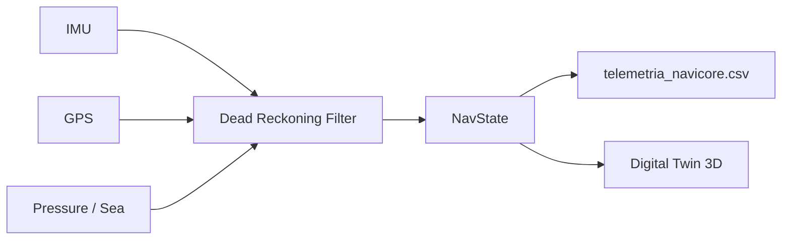

# NaviCore-3D: Multi-Domain Ultra-Low Power Navigation Core

**ES** · Núcleo de navegación unificado multimodal (tierra, aire, mar) diseñado para **edge computing** en microcontroladores de ultra-bajo consumo.  
**EN** · Unified multi-domain navigation core (land, air, sea) built for **edge computing** on ultra-low-power microcontrollers.

---

## Executive Summary / Resumen ejecutivo

| | **English** | **Español** |
|---|---|---|
| **Mission** | Provide a single navigation state model across domains, with dead reckoning when GNSS fails, ready for Ambiq Apollo (Cortex-M + FPU). | Ofrecer un modelo único de estado de navegación en todos los dominios, con navegación estimada cuando falla el GNSS, listo para Ambiq Apollo (Cortex-M + FPU). |
| **Language** | C++17 (PC simulator), embedded-oriented style: fixed structs, no heap. | C++17 (simulador PC), estilo embebido: estructuras fijas, sin heap. |
| **Memory** | **Zero dynamic allocation** in `core/` and `fusion/`: no `std::vector`, no `std::string`, fixed waypoint buffers, stack-only data paths. | **Cero asignación dinámica** en `core/` y `fusion/`: sin `std::vector`, sin `std::string`, buffers fijos, datos en stack. |
| **Math** | `sqrtf` / `sinf` / `cosf` with motion thresholds — skip redundant FPU work when the vehicle is stationary. | `sqrtf` / `sinf` / `cosf` con umbrales de movimiento — se evita trabajo FPU redundante con el vehículo parado. |
| **Coordinates** | Permanent 3D axes: **X = latitude**, **Y = longitude**, **Z = altitude (air) / hydrostatic pressure (sea)**. | Ejes 3D permanentes: **X = latitud**, **Y = longitud**, **Z = altitud (aire) / presión hidrostática (mar)**. |

---

## Architecture / Arquitectura

```
NaviCore-3D/
├── src/
│   ├── core/                   # Universal math engine (target-agnostic)
│   │   ├── NavState.*          # Unified navigation state
│   │   ├── vector3d.*          # Permanent 3D coordinate model
│   │   ├── waypoint.*          # Fixed-buffer route types
│   │   ├── fusion.*            # Dead reckoning + sensor fusion
│   │   ├── math_utils.hpp      # FPU thresholds (sqrtf/sinf/cosf)
│   │   └── sensor_types.hpp    # Portable IMU/GPS/pressure samples
│   └── targets/
│       ├── generic_pc/         # Open PC stress simulator
│       │   ├── main.cpp
│       │   └── sensors_sim.*   # Synthetic sensor feeds
│       └── ambiq_apollo/       # Ambiq Apollo bare-metal target (host stubs)
│           ├── main_ambiq.cpp
│           ├── bsp_sensors.*     # HAL orchestrator
│           ├── ambiq_system.*
│           └── drivers/          # Structural driver layer (SPI/DMA/GPIO/UART)
├── docs/
│   └── telemetria_navicore.csv # Digital Twin black-box export
├── CMakeLists.txt
└── build/                      # Local CMake output
```



**NavState** is the single source of truth: position, velocity, heading, mode (`GPS` · `DEAD_RECKONING` · `HYBRID`), and confidence (`estimate_quality`, satellite count, fix age).

---

## Validated Stress Scenarios / Escenarios de estrés superados

Both scenarios run sequentially in `NaviCore3D_Sim` at **100 ms** ticks and export every sample to the black-box CSV.

### 1 · GPS Loss (Air / Land) · Pérdida de GPS (Aire / Tierra)

| | |
|---|---|
| **Setup** | Cruise at **15 m/s**, heading **90°**, **8 satellites** with valid fix. |
| **Event** | At **t = 5 s**, satellites drop to **0** for **10 s**; GNSS updates stop. |
| **Expected** | Mode switches to **`DEAD_RECKONING`**; `estimate_quality` degrades monotonically with `fix_age_ms`; recovery at **t = 15 s**. |
| **Result** | ✅ Quality drops **0.790 → 0.295** during outage; full GNSS recovery after restore. |

### 2 · Submarine Immersion · Inmersión submarina

| | |
|---|---|
| **Setup** | Domain **SEA**, no GNSS; hydrostatic pressure rises at **+10 000 Pa/s**. |
| **Expected** | `Pos_Z` tracks pressure in Pa; `Vel_Z` ≈ **10 000 Pa/s** after first sample. |
| **Result** | ✅ `pos.z` reaches **201 325 Pa** at 10 s; `vel.z` stable at **10 000 Pa/s**. |

---

## Digital Twin 3D · Gemelo Digital 3D

The simulator exports a **black-box telemetry stream** for offline replay, visualization, and ML pipelines — the bridge between embedded firmware and a **3D Digital Twin**.

**File:** `docs/telemetria_navicore.csv` (created on each run)

| Column | Description |
|--------|-------------|
| `Timestamp_ms` | Simulation time [ms] |
| `Escenario` | `GPS_LOSS` or `SUBMARINE` |
| `Modo` | `GPS` · `DEAD_RECKONING` · `HYBRID` · `INITIALIZING` |
| `Calidad` | Confidence score 0.0 – 1.0 |
| `Satelites` | Scenario satellite count |
| `Pos_X` · `Pos_Y` · `Pos_Z` | Unified 3D position (lat °, lon °, alt m or Pa) |
| `Vel_X` · `Vel_Y` · `Vel_Z` | Velocity (m/s north/east/vertical or Pa/s) |
| `Rumbo` | Heading [°] |

Export uses **`fprintf`** — no dynamic allocations inside the simulation loop. Suitable as a reference pattern for SD-card logging on target hardware.

**Next step for the twin:** ingest CSV → time-series database → 3D scene (Cesium, Unity, or Unreal) with mode/confidence colour coding.

---

## Low-Power Architecture & Driver Topologies (NaviCore-Ambiq)

**EN** · The `NaviCore-Ambiq` target implements a granular hardware abstraction layer designed to squeeze the efficiency of subthreshold silicon (Ambiq SPOT®) without breaking host-PC compilation.  
**ES** · El target `NaviCore-Ambiq` implementa una capa de abstracción de hardware granular, optimizada para silicio subumbral (Ambiq SPOT®) y compilable en host-PC con stubs.

### Driver Subsystems Matrix / Matriz de subsistemas

| Subsystem | Role | Constraint |
|-----------|------|------------|
| **DMA (`ambiq_dma`)** | Monopolizes transactional memory moves. Eliminates CPU busy-waiting during high-throughput SPI and UART actions. | Non-blocking channels: SPI IMU + UART TX |
| **SPI IMU (`ambiq_spi_imu`)** | 12-byte hardware burst read mapped directly to `ImuSample`. Captures accelerometer and gyroscope raw channels in a single DMA transaction. | IOM0 @ 24 MHz, ICM-42688 register map |
| **GPIO GNSS (`ambiq_gpio_gnss`)** | Edge-triggered ISR on GPIO Pin 42 — updates fields only when the hardware pulse indicates valid data (no wasteful polling). | Fix cadence: 1 s (10 × 100 ms ticks) |
| **UART Telemetry (`ambiq_uart_telemetry`)** | Streams deterministic ASCII state frames (`NAV,t=...,m=...,q=...,px=...`) via non-blocking ring buffers managed by DMA TX. | UART0 @ 115200 baud |
| **Power Monitor (`ambiq_power_monitor`)** | Transactional current model (4.2 µA baseline ↔ 15.6 µA peak) and core execution clock cycles per tick. | 1800 mV nominal core (SPOT subthreshold) |

```
main_ambiq.cpp  (100 ms tick loop)
    └── bsp_sensors (HAL)
            ├── ambiq_spi_imu      → burst 12 B → ImuSample
            ├── ambiq_gpio_gnss    → INT pin 42 → GpsSample
            ├── ambiq_uart_telemetry → NAV ASCII frame → DMA TX
            ├── ambiq_power_monitor  → µA + active_cycles
            └── ambiq_dma            → channel arbitration
```

### Hardware Configuration Matrix (`ambiq_driver_config.hpp`)

| Parameter | Operational Specification | System Constraint |
| :--- | :--- | :--- |
| **IOM0 (SPI Master)** | 24 MHz clock speed | Synchronous burst |
| **UART0 (Telemetry)** | 115200 baud | Non-blocking ring buffer |
| **Core Voltage** | 1800 mV nominal | SPOT subthreshold mode |
| **Control Loop Tick** | 100 ms symmetrical | Hardware timer driven |
| **GNSS INT Pin** | GPIO 42, edge-triggered | ISR-driven, no polling |
| **DMA Timeout** | 500 000 cycles | Abort on channel stall |

Stubs in `drivers/*_stub.cpp` emulate DMA completion, SPI register bursts, GPIO interrupts, and UART TX so the same sources compile and link on the PC host. Replace stubs with Ambiq SDK HAL calls on silicon — interfaces stay unchanged.

---

## Build & Run / Compilar y ejecutar

**Requirements:** CMake ≥ 3.15, C++17 compiler (MinGW, MSVC, or Clang)

```powershell
cmake -S . -B build -G "MinGW Makefiles" -DCMAKE_BUILD_TYPE=Release
cmake --build build --target NaviCore3D_Sim    # PC stress simulator + CSV export
cmake --build build --target NaviCore3D_Ambiq  # Ambiq bare-metal loop (host stubs)
./build/NaviCore3D_Sim.exe
```

Console prints stress-test summaries; **`docs/telemetria_navicore.csv`** is written automatically (~302 data rows per run). `NaviCore3D_Ambiq` runs an infinite 100 ms control loop (no console output — expected for bare-metal stub).

---

## Roadmap

| Phase | Target |
|-------|--------|
| **Now** | PC simulator + CSV black box + fusion core hardened |
| **Now** | `NaviCore-Ambiq` — structural driver layer with host stubs (DMA/SPI/GPIO/UART/power) |
| **Next** | Ambiq SDK HAL swap-in on Apollo4 silicon; MRAM-conscious build |
| **Twin** | Live telemetry → Digital Twin 3D dashboard |

---

## License & Author

**Author:** Juan Carlos Pulido Mellado  
**License:** [MIT License](LICENSE) — Copyright (c) 2026 Juan Carlos Pulido Mellado

Private / showcase repository.  
**NaviCore-3D** — *Navigate every domain. Trust every fix. Zero waste on the edge.*
