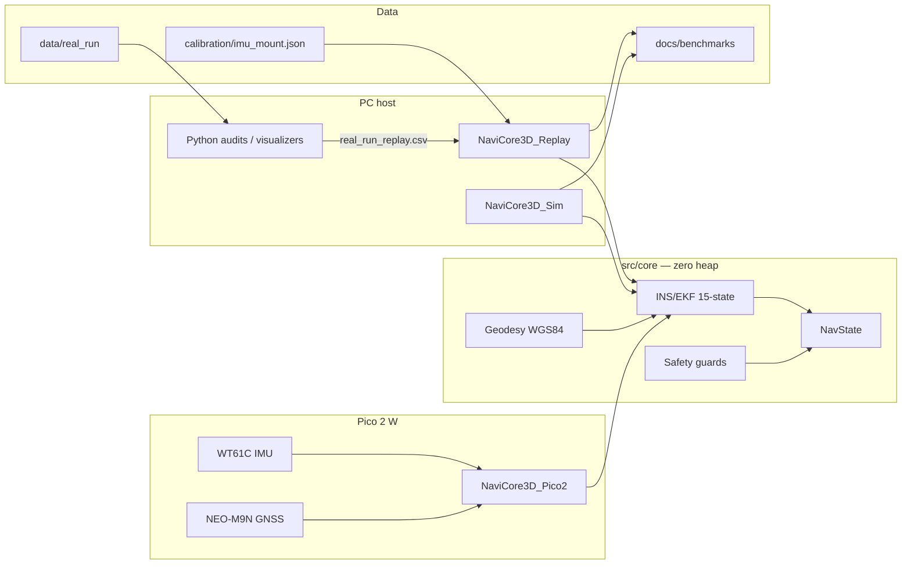

# NaviCore-3D: Edge INS for GPS-degraded / GPS-denied resilience

```cpp
// Haiku del Programador Defensivo en C++
//
//   Sin heap en el tick —
//   static_assert al amanecer:
//   parada segura.
```

**ES** · Núcleo **INS/ESKF 15 estados** para MCU edge: **resiliencia de navegación cuando el GNSS se degrada o deniega** (dead reckoning + integridad), no un “autopiloto multidominio” completo. Pico 2 W · replay real · lab Comarruga. Consumo: **medir con PPK2**.  
**EN** · **15-state INS/ESKF** edge core aimed at **navigation resilience under degraded/denied GNSS** (dead reckoning + integrity) — not a full multi-domain autopilot. Pico 2 W · real-run replay · Comarruga lab. Power: **measure with PPK2**.

---

## Contents / Contenido

1. [Quick start (local)](#quick-start-local)
2. [Positioning — GPS-denied resilience](#positioning--gps-denied--pnt-resilience)
3. [Executive summary](#executive-summary--resumen-ejecutivo)
4. [Evidence — published results](#evidence--published-results)
5. [NavMode degradation matrix](#navmode-degradation-matrix)
6. [Fusion algorithm (audit)](#fusion-algorithm--what-it-is--what-it-is-not)
7. [What validates the real firmware](#what-validates-the-real-firmware--pico-2-w)
8. [Power — measure before more hardware](#power--measure-before-more-hardware-ppk2)
9. [Repository layout](#repository-layout--estructura)
10. [Architecture](#architecture--arquitectura)
11. [Build](#build--compilar)
12. [Run simulator](#run-simulator--ejecutar-simulador)
13. [Real-run replay pipeline](#real-run-replay-pipeline)
14. [EKF diagnostics (H0–H9d, GAP-1…5)](#ekf-diagnostics-real-run)
15. [Calibration](#calibration--calibración)
16. [Python tooling](#python-tooling)
17. [Validated stress scenarios](#validated-stress-scenarios)
18. [Digital Twin / telemetry](#digital-twin--telemetry)
19. [Roadmap](#roadmap)
20. [License](#license--author)

---

## Quick start (local)

Requisitos mínimos en PC:

| Tool | Version |
|------|---------|
| CMake | ≥ 3.15 |
| C++ compiler | C++17 (MinGW, MSVC, or Clang) |
| Python | ≥ 3.10 (replay / audits / visualizers) |
| pip packages | `numpy`, `matplotlib`, `pandas` |

```powershell
# 1) Clone / open repo
cd C:\NaviCore-3D

# 2) Python deps (visualizers + GAP audits)
pip install numpy matplotlib pandas

# 3) Configure + build all PC targets
cmake -S . -B build -G "MinGW Makefiles" -DCMAKE_BUILD_TYPE=Release
cmake --build build

# 4) Smoke: stress simulator (writes docs\telemetria_navicore.csv)
.\build\NaviCore3D_Sim.exe --no-udp

# 5) Smoke: Catch2 units + safety-inject
.\build\navicore_unit_tests.exe
.\build\navicore_regression_test.exe --safety-inject
# or orchestrated:
python tools\run_regression_suite.py
```

Real-run EKF replay (datos en `data/real_run/`):

```powershell
python parse_mobile_log.py --input-dir data\real_run --output docs\benchmarks\real_run_replay.csv
cmake --build build --target NaviCore3D_Replay
.\build\NaviCore3D_Replay.exe --help
```

Documentación de reproducción completa: [`docs/diagnostics/06-reproduction.md`](docs/diagnostics/06-reproduction.md).

---

## Positioning — GPS-denied / PNT resilience

### The turn

| Old framing (weak as sole pitch) | Better framing |
|----------------------------------|----------------|
| “Unified land / air / sea navigation core” | **Navigation resilience when GNSS is degraded, denied, or lying** (civil *assured PNT*-style coast + integrity) |
| Multi-domain as the product | Shared ESKF + `NavState` **machinery**; domain aiding still per vertical |
| Compete with Honeywell / BAE / Thales / Collins | **Do not.** That tier is certified, export-controlled, defence/avionics-priced |
| Compete with ArduPilot / sealed u-blox modules | Fill the gap below mil-grade: **lightweight, auditable, MIT, zero-heap** resilience for cost-sensitive platforms |

### Who this is (and is not) for

| Segment | Fit |
|---------|-----|
| Defence / certified avionics PNT (Honeywell, BAE, Northrop, Thales, Collins, …) | **Out of scope** — price, ITAR/export, certification |
| **Civil / commercial underserved** — ag drones, low-cost AUVs, logistics robots, asset trackers, ocean buoys | **Target niche**: vulnerable to jamming/spoofing (accidental or not), no budget for mil PNT |
| Simulation / AV digital-twin as sole story | Secondary; less urgency and more crowded than GNSS resilience |

Volume and urgency sit in that middle band: enough GNSS dependency to hurt when the sky lies, not enough margin for a Collins box.

### What you already have (resilience-relevant)

| Mechanism | Where | Role |
|-----------|--------|------|
| Mode `GPS` → `HYBRID` → `DEAD_RECKONING` | `nav_mode_select` / EKF export | Coast when fix is weak or rejected — **full matrix:** [NAV_MODE_DEGRADATION.md](docs/NAV_MODE_DEGRADATION.md) |
| `estimate_quality` + fix age | `NavConfidence` | Degraded trust for mission / guards |
| GNSS NIS reject / accept | ESKF update | Integrity vs inconsistent innovation |
| INS predict without GNSS | ESKF @ ~100 Hz | Dead reckoning backbone |
| v2 fusion policy | `--ekf-core v2` | Keep position when velocity NIS fails (lab, 3 drives) |
| Pico 2 W + `safe_log` | Embedded DUT | Real outage / spoof-stress measurement |
| Consistency gate (`reject_reason=3`) | ESKF GNSS update | Fix present but IMU-incompatible → reject (SW spoof) |

Today you mostly react to **loss of fix** (age, reject, sats). That is necessary but not what “PNT resilience” sells hardest.

### The one technical wedge (not a redesign)

**Spoof / inconsistency detection (v1 shipped):** a fix that is still *present* but **physically incompatible with the IMU / INS** — gated on short GNSS gaps (`reject_reason=3`). Validated by **software injection** only (no RF spoof/jam).

| Today | Done |
|-------|------|
| Detect **GPS lost** (no fix / aged fix / NIS reject) | Detect **GPS lying** while `fix_valid` stays true (continuous track) |
| Dead reckoning after dropout | Flag spoof-suspect → refuse update; reacquire after long outage still via NIS |

Do **not** claim anti-jam RF, CRPA, or mil anti-spoof. Claim: **IMU-consistent integrity** on an auditable edge core.

### What you still must measure

| Gap | Why |
|-----|-----|
| Forced **outage** coast curve on Pico (+ optional truth logger) | Residual vs time under deny |
| Forced **spoof-like** injection in replay (teleport / velocity lie) | Shows the new detector before field RF |
| PPK2 current | Edge/low-power claim |

**Bottom line:** same architecture; reposition under civil GPS-denied resilience; consistency/spoof gate **shipped (v1)**; next credibility is **measured power + field outage**, not another slogan.

---

## Executive Summary / Resumen ejecutivo

| | **English** | **Español** |
|---|---|---|
| **Mission** | **GPS-degraded / denied resilience** on edge MCUs: coast with INS when the fix fails, expose integrity (`estimate_quality`, modes), auditable Q/R, zero heap. Multidomain = shared state, not the product slogan. | **Resiliencia GNSS degradado/denegado** en MCU edge: costa con INS, integridad (`estimate_quality`, modos), Q/R auditable, zero heap. Multidominio = estado compartido, no el eslogan. |
| **Estimator** | Explicit ESKF: position, velocity, attitude error, accel/gyro biases @ ~100 Hz. See [Fusion algorithm](#fusion-algorithm--what-it-is--what-it-is-not). | ESKF explícito: posición, velocidad, error de actitud, sesgos @ ~100 Hz. Ver [Fusion algorithm](#fusion-algorithm--what-it-is--what-it-is-not). |
| **Language** | C++17, embedded-oriented: fixed structs, no heap in `core/`. | C++17, estilo embebido: estructuras fijas, sin heap en `core/`. |
| **Memory** | **Zero dynamic allocation** in `core/`: no `std::vector`, no `std::string`, fixed buffers, stack-only hot paths. | **Cero asignación dinámica** en `core/`: sin `std::vector`/`std::string`, buffers fijos, hot path en stack. |
| **Frames** | Nav: **NED**. Body: **FRD** (+X forward, +Y right, +Z down). Quaternions: Hamilton. | Nav: **NED**. Cuerpo: **FRD**. Cuaterniones: Hamilton. |
| **Coordinates (NavState API)** | Permanent 3D axes: **X = latitude**, **Y = longitude**, **Z = altitude (air) / hydrostatic pressure (sea)**. | Ejes 3D permanentes: **X = latitud**, **Y = longitud**, **Z = altitud / presión hidrostática**. |
| **Host modes** | (1) Synthetic stress sim `NaviCore3D_Sim`. (2) Real vehicle replay `NaviCore3D_Replay`. | (1) Simulador de estrés. (2) Replay de vehículo real. |

---

## Evidence — published results

Numbers below are from **artefacts already in the repo** (not aspirational). Reproduce from the linked paths. Gaps called out honestly.

### EKF v2 vs v1 — real phone drives (NHC-off shell)

Same logs, same harness; only `--ekf-core`. Source: [`docs/benchmarks/ekf_v2_ab_3routes/`](docs/benchmarks/ekf_v2_ab_3routes/).

| Route | Core | GNSS accept rate | Final horizontal drift |
|-------|------|------------------|------------------------|
| REF_19082026 | v1 | 2.6% | **~158 km** |
| REF_19082026 | **v2** | **100%** | **~35 m** |
| ALT_16072026 | v1 | 2.4% | **~856 km** |
| ALT_16072026 | **v2** | **100%** | **~38 m** |
| JUL17_20260717 | v1 | 10.6% | **~332 km** |
| JUL17_20260717 | **v2** | **100%** | **~110 m** |

**Verdict:** v2 keeps position anchoring when velocity NIS fails (5-DoF joint reject in v1). Drift still **tens–hundreds of metres** — civil DR, not rail-grade.

### Monte Carlo — `TUNNEL_STRESS` (synthetic)

`run_monte_carlo.py` → `docs/monte_carlo/run_0000…run_0099` (**N = 100** seeds). Metric: horizontal drift at tunnel exit **t = 30 s**.

| Stat | Value |
|------|------:|
| Runs | **100** |
| Mean drift | **13.0 m** |
| Std | **1.26 m** |
| Min / max | 11.8 / 18.6 m |
| p95 / p99 | 16.1 / 18.5 m |
| Divergence rate (drift > 30 m) | **0%** |

### NHC — what the matrix actually showed

Not a marketing “NHC always helps” claim. Super-tunnel + R-sweep artefacts in [`docs/nhc_experiments/`](docs/nhc_experiments/) (`manifest.json`):

| Condition | Drift @ tunnel exit | Drift final (post-GNSS) |
|-----------|--------------------:|------------------------:|
| **A — NHC off** (baseline) | **493 m** | **~2 m** (reacquire) |
| Best G-arm (`G_l10_v10`) | 758 m | 887 m |
| `B_always` (NHC every tick) | 1408 m | 1554 m |

**Finding (GAP-3 closed):** naive high-rate NHC over-observes body velocity, compresses `P_vv`, and can **worsen** coasting vs NHC-off; dose-response N=1…20 documented. Operational policy: **NHC off** or **gap-triggered (v2)** — not “always on”.

Reproduce: `NaviCore3D_Sim.exe --nhc-experiments` · diagnostics [`docs/diagnostics/10-gap3-ins-model-audit.md`](docs/diagnostics/10-gap3-ins-model-audit.md).

### Allan variance (IEEE 952) — tooling ready, fit pending publish

| Item | Status |
|------|--------|
| Tool | [`analyze_allan.py`](analyze_allan.py) — overlapping Allan σ_A(τ); ARW/VRW, bias instability, RRW |
| Shipped Q scalars | σ_a = **0.05 m/s²**, σ_g = **0.002 rad/s** (car-log / mount order of magnitude in `ins_ekf.hpp`) |
| **Published ARW/BI table from multi-hour static IMU** | **Not yet** — needs `docs/imu_static_log.csv` (hours) then run Allan and paste IEEE units here |

Until that table exists, treat Q as **engineering defaults**, not a certified IMU datasheet.

### Integrity / spoof (software only)

| Check | Result |
|-------|--------|
| Teleport +500 m with `fix_valid=true` (short gap) | Rejected · `reject_reason=3` · test `gnss_physical_inconsistency_spoof` |
| RF GPS spoof / jam | **Out of scope** — illegal in ES/EU without CNMC authorisation |

### Catch2 unit tests (isolated — not the Sim pipeline)

Formal C++ unit tests (**Catch2 v3**, FetchContent) over kernels only — no Monte Carlo orchestration, no tunnel scenario:

| File | Covers |
|------|--------|
| `tests/unit/test_navstate_math.cpp` | `NavState` heading wrap, quality clamp, speed EPS (`math_utils.hpp`) |
| `tests/unit/test_ins_ekf_math.cpp` | `navicore_quat_normalize` (zero→identity), `mat_invert2x2/3x3` singular → false |
| `tests/unit/test_fusion_isolated.cpp` | `dead_reckoning_*` init + NaN/Inf reject |
| `tests/unit/test_properties_rapidcheck.cpp` | **RapidCheck** properties (see below) |

Math kernels live in [`src/core/ins_ekf_math.hpp`](src/core/ins_ekf_math.hpp) so the ESKF can be tested **without** linking Sim/Replay.

### RapidCheck property tests (above unit cases)

Properties that must hold for *all* generated inputs (default **300** trials via `RC_PARAMS=max_success=300`; shrinks counterexamples):

| Property | Statement |
|----------|-----------|
| Fix-age quality | `age_a ≤ age_b` ⇒ `quality(age_a) ≥ quality(age_b)` (`nav_confidence_quality_from_fix_age_ms`) |
| Heading | `normalize(h) ∈ [0, 360)` for bounded `h` |
| Quaternion | after normalize, ‖q‖ ≈ 1 (zero-norm → identity, no `/0`) |
| S⁻¹ | if `invert2x2` succeeds ⇒ `S·S⁻¹ ≈ I` |
| EKF @ 100 Hz | one 10 ms predict: horizontal ‖Δp‖ ≤ civil envelope (~1.3 m for \|v\|≤80, \|a\|≤40) |

This is stricter than Monte Carlo over fixed scenarios: the fuzzer searches for breaks, not just average drift.

```powershell
cmake -S . -B build -G "MinGW Makefiles" -DCMAKE_BUILD_TYPE=Release -DNAVICORE_BUILD_UNIT_TESTS=ON
cmake --build build --target navicore_unit_tests
$env:RC_PARAMS="max_success=500"
.\build\navicore_unit_tests.exe
# filter properties only:
.\build\navicore_unit_tests.exe "[rapidcheck]"
```

Disable all unit/property builds with `-DNAVICORE_BUILD_UNIT_TESTS=OFF`.

### Safety inject tests (error paths)

Fail-closed paths exercised by `navicore_regression_test --safety-inject` (CI + ASan):

| Test | What it proves |
|------|----------------|
| `imu_nan_reject` | `ins_ekf_predict` / DR reject NaN/Inf IMU; state unchanged |
| `waypoint_full_ingest_reject` | Radio `ADD_WAYPOINT` rejected at 64/64 (no silent overwrite) |
| `time_guard_wcet` | Over-budget ticks → `TIME_GUARD_ERROR_WCET` + health penalty |
| `geometry_guard_discontinuity` | Step ≫ 150 m → `GEOMETRY_ERROR_DISCONTINUITY` |
| `nmea_ubx_corrupt_wire` | NMEA assembler / UBX oversize / WT61C noise → fail-closed (no bogus sample) |
| `fault_imu_silence_policy` | IMU silence ≥ 200 ms → `DEGRADED` + `imu_should_degrade` (host mirror of Pico) |
| `fault_uart_overflow_and_power` | UART overflow rate → degrade; power offline / task starvation → **CRITICAL** |
| (+ gravity, spoof) | Smoke of core ESKF + consistency gate |

```powershell
.\build\navicore_regression_test.exe --safety-inject
```

Full suite (includes legacy NHC/TC benchmarks that may still FAIL): omit the flag.

### Sensor wire fuzzing (NMEA / UBX / WT61C)

Parsers live in host-buildable core (`nmea_parser`, `ubx_parser`, `wt61c_parser`) — same code Pico BSP calls. libFuzzer (Clang) + ASan/UBSan hunt overflows / UB on corrupt frames; seed corpus in `tests/fuzz/corpus/`.

```bash
# Linux / CI (Clang)
cmake -S . -B build_fuzz -G Ninja -DCMAKE_CXX_COMPILER=clang++ -DNAVICORE_BUILD_FUZZERS=ON
cmake --build build_fuzz --target navicore_sensor_wire_fuzz
./build_fuzz/navicore_sensor_wire_fuzz tests/fuzz/corpus -max_total_time=60

# Windows / AFL-style: corpus or stdin driver (no libFuzzer runtime)
cmake -S . -B build -DNAVICORE_BUILD_FUZZERS=ON
cmake --build build --target navicore_sensor_wire_fuzz_standalone
.\build\navicore_sensor_wire_fuzz_standalone.exe tests\fuzz\corpus\nmea_valid_gga
```

CI job: `sensor-wire-fuzz` in [code-audit.yml](.github/workflows/code-audit.yml).

### Hardware fault injection (lab)

Host tests assert **policy**. On-target checklist (unplug IMU, UART flood, UPS/I2C, hard power cut, WDT):  
[`docs/FAULT_INJECTION_LAB.md`](docs/FAULT_INJECTION_LAB.md). Pico now treats IMU silence ≥ `PICO2_IMU_SILENCE_DEGRADE_MS` as `imu_degraded`.

### Code audit (A5) — baseline + CI

| Item | Result |
|------|--------|
| Standard | [docs/SAFETY_CODING_STANDARD.md](docs/SAFETY_CODING_STANDARD.md) (MISRA-inspired, not certified) |
| cppcheck `--enable=all` on `src/core` | Local baseline + **CI job** — [REPORT_LATEST](docs/benchmarks/static_analysis/REPORT_LATEST.md) |
| gcov (`navicore_regression_test`) | **~50%** line cover on linked ESKF TUs (pre–inject expansion); re-run after `--safety-inject` links guards |
| clang-tidy | `.clang-tidy` + **CI job** (Ubuntu/Clang) |
| ASan + UBSan | **CI job** builds with Clang `-fsanitize=address,undefined` and runs `--safety-inject` |
| Catch2 + RapidCheck | **CI job** `navicore_unit_tests` — units + properties + wire/health |
| libFuzzer (NMEA/UBX/WT61C) | **CI job** `sensor-wire-fuzz` — 60 s smoke on corpus |
| Workflow | [`.github/workflows/code-audit.yml`](.github/workflows/code-audit.yml) |
| Runner (local) | `python tools/run_static_analysis.py --cppcheck` · `--clang-tidy` · `--coverage-build` |

### Still missing for “demo-ready” credibility

| Gap | Why it matters |
|-----|----------------|
| PPK2 current on Pico 2 W | “Ultra-low power” stays architectural until measured |
| Forced field outage (Pico + truth GPX) | Coast curve vs time on hardware |
| Allan fit from hours of static IMU | Replace Q folklore with IEEE numbers |
| Logged lab fault-injection campaign | Host policy covered; fill `docs/benchmarks/fault_injection/` after bank run |
| Field + PPK2 artefacts published | Coast curve + mA/mW table still empty — needed before “going viral” |

### Diagnostic campaign (real-run)

| Phase | Status |
|-------|--------|
| GAP-1 … GAP-4, G-ext | **CLOSED** |
| GAP-5 v1 (adaptive NHC) | **CLOSED** — passive path inactive under preregistered ops |
| GAP-5 v2 | Preregistered / paused |
| Attitude snapshot (static 0–2 s) | EKF↔Orientation **0.05°**, gravity **0.09°** |

Full map: [EKF diagnostics](#ekf-diagnostics-real-run).

---

## NavMode degradation matrix

Integrator-facing contract (transitions + honest precision envelopes):  
**[`docs/NAV_MODE_DEGRADATION.md`](docs/NAV_MODE_DEGRADATION.md)**

| Mode | When (EKF / Pico) | Trust sketch |
|------|-------------------|--------------|
| `HYBRID` | Fix valid **and** GNSS accept ≤ 2 s | Highest — INS+GNSS; quality `0.55+0.03×sats` ∈ [0.55, 0.95] |
| `GPS` | Fix valid, accept **stale** (> 2 s) | Weak GNSS — quality 0.65; do not treat as fresh hybrid |
| `DEAD_RECKONING` | No fix **or** GNSS outlier | Coast; quality from fix age (or 0.25 on outlier). Lab: ~13 m @ 30 s synthetic; phone v2 coast tens–~110 m |
| `INITIALIZING` | Not seeded | Do not steer |

Overlays (halve quality, may not change mode): IMU silence, UART overflow, **IMU vigilante cross-check**, GNSS degrade.

Tests: `navicore_unit_tests "[navmode],[imu_cross]"`.

### Watchdogs (on-chip + external)

| Layer | What | Independence |
|-------|------|----------------|
| RP2350 `hardware/watchdog` | On-chip HW WDT, 50 ms, kick **end-of-loop only** | Same silicon as firmware — not a software timer, but **not** die-independent |
| External supervisor (TPL5010 / MAX6822) | Optional pulse on **GP15** (`PICO2_EXT_WDT_ENABLE`) | **Independent** of the MCU die — use this for true hang survival |

I2C UPS recovery **no longer** pets the WDT (a stuck recovery must trip).

### Dual-IMU vigilante

Optional MPU-6050 on I2C0 (GP8/9): compares with WT61C; on disagreement sets `imu_cross_fail` and halves quality — **does not** replace the primary in the EKF. Enable `PICO2_SECONDARY_IMU_ENABLE`.

---

## Fusion algorithm — what it is / what it is not

This is the section a serious reviewer should read first.  
**Not** a vague “dead reckoning + sensor fusion” blend: a **15-state error-state Kalman filter (ESKF)** with an explicit state, explicit innovations, and **documented Q / R / P₀** (source of truth: [`src/core/ins_ekf.hpp`](src/core/ins_ekf.hpp) + `ins_ekf_init` / `ins_ekf_build_process_noise`).

### What it is

| Item | Fact |
|------|------|
| **Filter class** | **Error-state Kalman filter (ESKF / MEKF-style)** — Joseph covariance update. Not complementary filter, not α-β, not “GPS glue”. |
| **Nominal** | `p_NED`, `v_NED`, `q` (body→NED), `b_a`, `b_g` |
| **Error state** | 15×1 δx (table below); mean reset after each inject |
| **Predict @ ~100 Hz** | `ω_corr = ω − b_g` → quat; `a_lin = R·(f − b_a) − g`; integrate `v`,`p`; sparse Φ; add Q |
| **Updates** | GNSS (pos / pos+vel / vel); optional **NHC**, **ZUPT** — policy-armed |
| **Platform** | Float-only, **zero heap** in `src/core/` |
| **Cores** | v1: `ins_ekf.cpp`. v2: `--ekf-core v2` (`ins_ekf_v2.hpp`) — same 15-state container, different predict/GNSS/NHC policy |

Body frame: [`docs/diagnostics/08-body-frame-contract.md`](docs/diagnostics/08-body-frame-contract.md).

### Error-state vector (15)

| Index | Symbol | Meaning | Unit |
|------:|--------|---------|------|
| 0–2 | δp_N, δp_E, δp_D | Position error | m |
| 3–5 | δv_N, δv_E, δv_D | Velocity error | m/s |
| 6–8 | δθ_x, δθ_y, δθ_z | Attitude error (small-angle) | rad |
| 9–11 | δb_ax, δb_ay, δb_az | Accel bias error | m/s² |
| 12–14 | δb_gx, δb_gy, δb_gz | Gyro bias error | rad/s |

Enum: `InsEkfErrorIdx` in [`ins_ekf.hpp`](src/core/ins_ekf.hpp).

### Innovation sources (what feeds the filter)

| Source | In EKF today? | Observation / notes |
|--------|---------------|---------------------|
| **IMU accel + gyro** | Yes (predict) | Specific force & angular rate @ tick; mount matrix in replay |
| **GNSS position** LLA→NED | Yes | `y = z_NED − p̂`; `R_pos` diagonal |
| **GNSS horizontal velocity** | Yes (optional) | From speed × course; `pos_vel` / `vel_only` |
| **NHC** | Optional | Pseudo-meas: body lateral/vertical velocity ≈ 0 |
| **ZUPT** | Optional | Pseudo-meas: velocity ≈ 0 when stationary policy fires |
| **Barometer / depth** | **No** (not in ESKF update) | Domain fields exist on NavState API; not an EKF innovation yet |
| **Magnetometer** | **No** | Not used as attitude update in this core |
| **Vision / wheel odometry** | **No** | Out of scope of current core |

Honesty for auditors: multi-domain *NavState* is the shared API; **domain-specific aiding** (mag, baro, DVL, airspeed) is **not** claimed as already fused.

### Tuning — process noise Q, measurement R, initial P₀

An EKF lives or dies on Q and R. Defaults below are the **compile-time / init values** shipped in the core (overrideable at runtime for GNSS vel std, NHC σ, scales in replay). Field campaigns should **re-estimate** these from logged residuals — that dataset is more convincing than any synthetic scenario.

#### Process noise Q (diagonal blocks per `ins_ekf_build_process_noise`)

Built each predict from PSD-style scalars × `dt`:

| Block | Construction | Default scalar |
|-------|--------------|----------------|
| Q_pos | `σ_a² · dt²` | `σ_a = 0.05 m/s²` (`NAVICORE_INS_EKF_ACCEL_NOISE_STD_MPS2`) |
| Q_vel | `σ_a² · dt` | same σ_a |
| Q_att | `σ_g² · dt` | `σ_g = 0.002 rad/s` (`NAVICORE_INS_EKF_GYRO_NOISE_STD_RADPS`) |
| Q_ba | `PSD_ba · dt` | `1e-6` (`NAVICORE_INS_EKF_BIAS_ACCEL_RW_VAR`) |
| Q_bg | `PSD_bg · dt` | `1e-10` (`NAVICORE_INS_EKF_BIAS_GYRO_RW_VAR`) |

Comments in header: σ_a / σ_g aligned with **real car-log / mount vibration** order of magnitude, not optimistic lab IMU.

#### Measurement noise R

| Measurement | Default | Macro / field |
|-------------|---------|---------------|
| GNSS position (per axis) | **6.0 m²** (σ ≈ 2.45 m) | `NAVICORE_INS_EKF_GNSS_POS_VAR_M2` → `gnss_pos_var_m2` |
| GNSS horizontal velocity | **σ = 1.5 m/s** → 2.25 m²/s² | `NAVICORE_INS_EKF_GNSS_VEL_STD_MPS` |
| NHC lateral / vertical | σ = 0.5 / 1.0 m/s | `NAVICORE_INS_EKF_NHC_*_STD_MPS` |
| ZUPT velocity | σ = 0.05 m/s | `NAVICORE_INS_EKF_ZUPT_VEL_STD_MPS` |

Replay can raise GNSS σ from phone accuracy columns (floored) and override `--gnss-vel-std-mps`, `--nhc-sigma`.

#### NIS gates (χ² @ 99%)

| Mode | DoF | Threshold |
|------|-----|-----------|
| Position only | 3 | 11.345 |
| Velocity only | 2 | 9.210 |
| Pos+vel (v1 joint) | 5 | 15.086 |

#### Initial covariance P₀ (`ins_ekf_init` diagonals)

| State | P₀ diag |
|-------|---------|
| pos N,E / D | 4 / 4 / 9 m² |
| vel N,E,D | 1 m²/s² |
| att roll,pitch / yaw | (5°)² / (10°)² |
| accel bias | 0.25 (m/s²)² |
| gyro bias | 0.01 (rad/s)² |

### What it is not (do not over-claim)

| Claim to avoid | Reality |
|----------------|---------|
| “Competes with u-blox / full ArduPilot stack” | Different product class. Niche: **lightweight, auditable, zero-heap ESKF core** (MIT) between heavy autopilot stacks and sealed commercial modules — **potential**, not traction yet. |
| “One untuned filter owns land/air/sea ops” | Shared **state + predict**; each domain still needs its own aiding/R. Multidomain is **architecture**, not the headline — see [Positioning](#positioning--gps-denied--pnt-resilience). |
| “Assured PNT / anti-jam product” | Civil **integrity + DR** story only. No RF anti-jam; spoof gate = **EKF consistency check** (`reject_reason=3`, SW injection only), not mil stack. No Honeywell comparison. |
| “Proven automotive / maritime DR” | **Not yet.** Phone-log replay ≠ certified outage campaign on Pico+M9N. |
| “Baro/mag already in the EKF” | **Not in the update.** See innovation table. |
| “v2 is a smaller toy filter” | Same 15-state ESKF; different fusion **policy**. |

### v1 vs v2 fusion policy

| | **v1** (`--ekf-core v1`) | **v2** (`--ekf-core v2`) |
|--|--------------------------|--------------------------|
| GNSS `pos_vel` | Joint **5-DoF** NIS; bad velocity can reject **whole** fix | Pos / vel **separate**; position keeps anchoring |
| Predict | Semi-implicit `p`; NHC may run inside predict | Trapezoidal `p`; term budget; no NHC in predict |
| NHC | Stride when enabled | GNSS-gap triggered (doc 17) |
| Status | Historical control | Candidate — A/B 3 routes [`ekf_v2_ab_3routes`](docs/benchmarks/ekf_v2_ab_3routes/) |

### Where vibration and multipath still hurt

Phone IMU + phone GNSS stay in the loop on the published city drives. Between fixes, attitude / `R·f` errors still write Δv. Expect **tens–hundreds of metres** residual with current Q/R — not rail-grade — until **field outage residuals** are used to retune Q/R and (later) domain aiding.

**Next evidence that raises confidence more than any feature:** forced GNSS outage on a real drive or Pico+M9N, with residual growth vs time and the Q/R used frozen in the report.

---

## What validates the real firmware — Pico 2 W

The **device under test (DUT)** for NaviCore-3D is the firmware that already runs on the **Raspberry Pi Pico 2 W (RP2350)** — the same C++ ESKF in `src/core/`, not a reimplementation elsewhere.

| Role | Platform | Validates? |
|------|----------|------------|
| **DUT / instrument** | **Pico 2 W** + USB CDC to PC (`safe_log.*`, non-blocking stdio) | **Yes** — the real EKF binary, WCET, UART rings, field/lab telemetry |
| Host replay | `NaviCore3D_Replay` on PC | Deterministic regression on logged CSVs — same algorithms, **not** a substitute for embedded timing/I/O |
| Optional external truth | e.g. Pi Zero / phone / survey GNSS logging in parallel | Independent **reference track** to compare *against* Pico estimate — **not** a second NaviCore |
| Python / Ambiq / other MCU ports | Parallel approximations | Useful experiments; **do not** claim they validate Pico firmware |

### Why not “run NaviCore on a Pi Zero instead”

A Python (or other) EKF on a Pi Zero measures **that** stack. It does **not** measure:

- the zero-heap C++ core on RP2350,
- the real IMU/GNSS UART path,
- `safe_log` / USB budget inside the 100 Hz loop,
- WDT / health behaviour under load.

Use a second board only if you need a **ground-truth logger** (or independent estimator) riding along — then compare truth vs Pico USB stream. Wiring: [docs/comarruga_lab_hardware.md](docs/comarruga_lab_hardware.md) (USB CDC, `safe_log_flush_pending`, pin map).

### Correct next measurement (dead reckoning)

1. Flash current Pico 2 W firmware (same core as lab).
2. PC captures USB/`safe_log` (and/or on-device log) while GNSS is **denied or blocked** for a known interval.
3. Score residual growth vs time on **that** stream — optionally vs a parallel truth logger.
4. Freeze Q/R used in the report.

Replay of phone CSVs remains valuable for algorithm A/B (v1/v2); **embedded DR proof** requires the Pico path above.

---

## Power — measure before more hardware (PPK2)

The project tagline includes **ultra-low power / edge MCU**. That claim is currently **architectural** (zero-heap hot path, Pico 2 W target, non-blocking USB) — **not** yet backed by a published current draw from a Nordic **Power Profiler Kit II (PPK2)** or equivalent.

**Priority before adding Pi Zero, Ambiq, or other boards:** measure the **Pico 2 W** running the real firmware. It is the cheapest, fastest experiment and the one that most directly supports (or falsifies) the central product claim.

| Do first | Do later |
|----------|----------|
| PPK2 on Pico 2 W + document mA / mW here | Pi Zero as parallel truth logger |
| Same for IMU+GNSS on / off profiles | Port to Ambiq **before** Pico PPK2 baseline |
| After Pico numbers: Artemis/Apollo3 same GPS-denied scenario | Claim “ultra-low power” without measured mA |
| Later: Apollo4 (+ edge AI for richer integrity) | Skip Artemis and jump straight to Apollo510 |
| Freeze build hash + profile in the table | Marketing “µA-class” without numbers |

### Measurement protocol (lab)

1. **Instrument:** Nordic PPK2 (source or ampere meter mode as appropriate for the board supply).
2. **DUT:** Pico 2 W flashed with `pico2_hardware` firmware under test (record git commit / build id).
3. **Supply:** Measure **board + MCU path** you care about; note whether Wi-Fi, USB CDC, external IMU (WT61C), GNSS (NEO-M9N) are powered from the same rail.
4. **Profiles** (run ≥30–60 s steady each; report mean and peak):

| ID | Profile | Expected intent |
|----|---------|-----------------|
| P0 | MCU idle / clocks only (if available) | Floor |
| P1 | Nav loop @ 100 Hz, USB CDC on, **no** Wi-Fi, sensors as in Comarruga bank | Typical lab estimate |
| P2 | P1 + Wi-Fi activity (if enabled in build) | Upper bound with radio |
| P3 | Deep sleep / safe shutdown path (if exercised) | Conservation claim |

5. **Publish:** fill the table below — do **not** invent placeholders as facts. Until filled, treat “ultra-low power” as **design goal**, not measured evidence.

### Measured results (fill after PPK2)

| Profile | V_supply [V] | I_mean [mA] | I_peak [mA] | P_mean [mW] | Build / commit | Date | Notes |
|---------|-------------:|------------:|------------:|------------:|----------------|------|-------|
| P0 | — | **TBD** | TBD | TBD | | | |
| P1 | — | **TBD** | TBD | TBD | | | Comarruga sensors |
| P2 | — | **TBD** | TBD | TBD | | | |
| P3 | — | **TBD** | TBD | TBD | | | |

Artefacts (CSV/PNG from nRF Connect / PPK2 export) belong under `docs/benchmarks/power_ppk2/` when available.

---

## Repository layout / Estructura

```
NaviCore-3D/
├── src/
│   ├── core/                      # Motor universal (EKF, geodesia, fusion, guards)
│   ├── scenarios/                 # TUNNEL_STRESS, SLALOM
│   └── targets/
│       ├── generic_pc/            # Sim, VehicleDemo, Replay, benchmarks
│       └── pico2_hardware/        # Pico 2 W @ 100 Hz (banco Comarruga)
├── data/
│   └── real_run/                  # CSVs Android Sensor Logger (~332 s)
├── calibration/
│   └── imu_mount.json             # Matriz sensor→body FRD (Rodrigues)
├── tests/unit/                    # Catch2 + RapidCheck (kernels aislados)
├── .github/workflows/             # CI code-audit (cppcheck · tidy · ASan · units)
├── docs/
│   ├── diagnostics/               # Metodología H0–H9d + GAP-1…5
│   ├── benchmarks/                # Evidence packs (EKF v2 A/B, static analysis, …)
│   ├── ROADMAP_PNT_RESILIENCE.md  # Tracks código / hardware / visibilidad
│   ├── SAFETY_CODING_STANDARD.md  # Guía MISRA-inspired (no certificación)
│   ├── monte_carlo/               # Trazas Monte Carlo
│   ├── nhc_experiments/           # Experimentos NHC del sim
│   └── telemetria_navicore.csv    # Black-box del simulador
├── tools/                         # Visualizers, regression, audits, static analysis
├── parse_mobile_log.py            # Sensor Logger → replay CSV
├── CMakeLists.txt                 # Build PC (+ optional unit tests)
├── DEVELOPMENT.md
├── README.md
└── build/                         # Salida CMake local (no versionar)
```

| Path | Role |
|------|------|
| `src/core/` | INS/EKF 15-state (ESKF), NavState, geodesy WGS84, guards — see Fusion algorithm |
| `src/scenarios/` | Escenarios cuantitativos (`tunnel_stress`, `slalom_scenario`) |
| `src/targets/generic_pc/` | Host: sim, replay, UDP telemetry, adaptive NHC controller |
| `src/targets/pico2_hardware/` | Embedded: BSP IMU/GNSS/UPS, health monitor, WDT |
| `tests/unit/` | Catch2 + RapidCheck formal units/properties |
| `data/real_run/` | Entrada cruda del vehículo (Android Sensor Logger), carpetas por fecha |
| `docs/benchmarks/` | Evidence + audits (bulk regenerable CSV ignored — see `.gitignore`) |
| `docs/diagnostics/` | Documentación científica del pipeline EKF |
| `tools/` | Scripts Python de visualización, regresión y GAP |
| `calibration/` | Calibración de montaje IMU |

Unity EKF Explorer (`ekf_explorer/`) is **local-only** (Cesium/Unity binaries ≫ GitHub limits). Protocol: [`docs/diagnostics/19-ekf-explorer-protocol.md`](docs/diagnostics/19-ekf-explorer-protocol.md).

Contexto de desarrollo y prioridades RT: [`DEVELOPMENT.md`](DEVELOPMENT.md).

---

## Architecture / Arquitectura



**NavState** is the single source of truth for the guidance/API layer: position, velocity, heading, mode (`GPS` · `DEAD_RECKONING` · `HYBRID`), and confidence (`estimate_quality`, satellite count, fix age).

**INS/EKF** — see [Fusion algorithm](#fusion-algorithm--what-it-is--what-it-is-not): real **15-state ESKF** (predict + Joseph GNSS/NHC/ZUPT), not a simplified complementary blend. Replay selects `--ekf-core v1|v2`.

Body-frame contract (normative): [`docs/diagnostics/08-body-frame-contract.md`](docs/diagnostics/08-body-frame-contract.md).

---

## Build / Compilar

### PC targets (root `CMakeLists.txt`)

```powershell
cmake -S . -B build -G "MinGW Makefiles" -DCMAKE_BUILD_TYPE=Release
cmake --build build
```

| Target | Binary | Description |
|--------|--------|-------------|
| `NaviCore3D_Sim` | `build\NaviCore3D_Sim.exe` | Stress simulator + CSV/UDP telemetry |
| `NaviCore3D_VehicleDemo` | `build\NaviCore3D_VehicleDemo.exe` | CAN vehicle-bus demo + HMI |
| `NaviCore3D_Replay` | `build\NaviCore3D_Replay.exe` | Real-run EKF replay + audit hooks |
| `navicore_regression_test` | `build\navicore_regression_test.exe` | C++ regression / `--safety-inject` |
| `navicore_unit_tests` | `build\navicore_unit_tests.exe` | Catch2 + RapidCheck (NavState / math / fusion / wire / health) |
| `navicore_sensor_wire_fuzz(_standalone)` | optional `-DNAVICORE_BUILD_FUZZERS=ON` | libFuzzer or corpus/stdin driver |
| `ring_stress_test` | `build\ring_stress_test.exe` | Host SPSC UART stress (S7 campaign) |

Build a single target:

```powershell
cmake --build build --target NaviCore3D_Replay
cmake --build build --target NaviCore3D_Sim
```

On Windows, the sim links `ws2_32` for UDP telemetry.

### Audit builds (sanitizers / coverage)

```powershell
# Coverage (gcov)
cmake -S . -B build_coverage -G "MinGW Makefiles" -DCMAKE_BUILD_TYPE=Debug -DNAVICORE_ENABLE_COVERAGE=ON
cmake --build build_coverage --target navicore_regression_test
.\build_coverage\navicore_regression_test.exe --safety-inject

# ASan+UBSan — prefer Clang/Linux (MinGW often lacks libasan)
cmake -S . -B build_asan -G Ninja -DCMAKE_CXX_COMPILER=clang++ -DCMAKE_BUILD_TYPE=Debug -DNAVICORE_ENABLE_SANITIZERS=ON
cmake --build build_asan --target navicore_regression_test
./build_asan/navicore_regression_test --safety-inject
```

CI: [`.github/workflows/code-audit.yml`](.github/workflows/code-audit.yml) (cppcheck · clang-tidy · ASan · Catch2+RapidCheck).  
Report: [`docs/benchmarks/static_analysis/REPORT_LATEST.md`](docs/benchmarks/static_analysis/REPORT_LATEST.md) · standard: [`docs/SAFETY_CODING_STANDARD.md`](docs/SAFETY_CODING_STANDARD.md).

### Pico 2 W (`NaviCore3D_Pico2`)

Requires [Pico SDK](https://github.com/raspberrypi/pico-sdk) and Ninja:

```powershell
$env:PICO_SDK_PATH = 'C:\path\to\pico-sdk'
cmake -S src\targets\pico2_hardware -B build_pico2 -G Ninja
cmake --build build_pico2
```

Copy `src/targets/pico2_hardware/wifi_config.h.example` → `wifi_config.h` before building Wi-Fi features.

Hardware notes: [`docs/comarruga_lab_hardware.md`](docs/comarruga_lab_hardware.md).  
Validated lab release tag: `pico2-comarruga-banco-v1`.

---

## Run simulator / Ejecutar simulador

```powershell
.\build\NaviCore3D_Sim.exe
```

| Flag | Effect |
|------|--------|
| `--no-udp` | Disable UDP telemetry (CI / headless) |
| `--run-tests` | Run embedded regression suite |
| `--scenario SLALOM` | Slalom tracking scenario |
| `--scenario TUNNEL_STRESS` | Multi-phase tunnel profile |
| `--super-tunnel` | NHC vs no-NHC comparison |
| `--nhc-experiments` | Super-tunnel NHC experiment matrix |
| `--stress` / `--high-stress` | WCET / radio-burst stress |
| `--clean` | Clean mission (no fault injection) |
| `--seed N` | RNG seed (default: system clock) |
| `--csv-out <path>` | Override telemetry CSV path |
| `--replay <csv>` | SiL replay from CSV |

Default black-box export: `docs/telemetria_navicore.csv`.

Vehicle bus demo:

```powershell
.\build\NaviCore3D_VehicleDemo.exe
```

Quantitative sim benchmarks:

```powershell
python run_all_benchmarks.py
```

Live / offline visualization:

```powershell
# Offline 3D CSV replay
python tools\visualizer.py

# Live UDP (run Sim in another terminal without --no-udp)
python tools\remote_visualizer.py
```

---

## Real-run replay pipeline

End-to-end flow for Android Sensor Logger captures:

```
data/real_run/*.csv
    → parse_mobile_log.py
    → docs/benchmarks/real_run_replay.csv
    → NaviCore3D_Replay.exe (+ calibration/imu_mount.json)
    → docs/benchmarks/*_output.csv / *_report.json / *.png
    → tools/audit_gap*.py  (scientific auditors)
```

### Input data (`data/real_run/`)

| File | Use |
|------|-----|
| `AccelerometerUncalibrated.csv` | **Primary IMU accel input** for replay |
| `Gyroscope.csv` | Gyro |
| `Location.csv` | GNSS lat/lon/alt, speed, bearing |
| `Orientation.csv` | Android attitude (external reference, not GT) |
| `Gravity.csv` | Android gravity estimate |
| `TotalAcceleration.csv` | Total acceleration |
| `Metadata.csv` | Recording metadata |
| `Accelerometer.csv` | Identity / audit only — **do not** feed as replay IMU |
| `Annotation.csv` | Optional annotations |

Short legacy capture archived under `docs/_archive_short_run_jul15/`.

### Prepare replay CSV

```powershell
python parse_mobile_log.py `
  --input-dir data\real_run `
  --output docs\benchmarks\real_run_replay.csv
```

### Example: H9 predict-only (60 s)

```powershell
.\build\NaviCore3D_Replay.exe `
  --input docs\benchmarks\real_run_replay.csv `
  --output docs\benchmarks\h9_predict_only_output.csv `
  --constraint-policy disabled `
  --predict-only --predict-only-end-s 60 `
  --h9a-gravity-tilt-init `
  --mount-calibration calibration\imu_mount.json `
  --predict-audit-csv docs\benchmarks\h9_predict_only_audit.csv
```

### Example: scientific baseline (constraints explicit)

```powershell
.\build\NaviCore3D_Replay.exe `
  --input docs\benchmarks\real_run_replay.csv `
  --output docs\benchmarks\gap3_baseline_output.csv `
  --constraint-policy imu_stationary `
  --nhc-policy enabled `
  --nhc-every-n-ticks 1 `
  --mount-calibration calibration\imu_mount.json
```

### Important replay flags

| Flag | Values / purpose |
|------|------------------|
| `--input`, `--output` | Replay CSV paths |
| `--mount-mode` | `none`, `legacy`, `calibration` |
| `--mount-calibration` | Path to `imu_mount.json` |
| `--yaw-init` | `zero`, `gnss_stable`, `h3` |
| `--predict-only` | Disable GNSS/NHC/ZUPT updates |
| `--predict-only-end-s`, `--replay-end-s` | Time window |
| `--h9a-gravity-tilt-init` | Init roll/pitch from gravity |
| `--constraint-policy` | **Required.** `forced_time`, `gps_stop`, `imu_stationary`, `disabled` (`auto` rejected) |
| `--nhc-policy` | `enabled`, `disabled` |
| `--nhc-every-n-ticks N` | NHC decimation |
| `--gnss-obs-mode` | `pos`, `pos_vel`, `vel_only` |
| `--p-pv-policy` | `none`, `gap_le_1s`, `zero`, `cos_pos`, `cos_tot` |
| `--adaptive-nhc` | `off`, `passive`, `active` |
| `--p0-scale`, `--q-scale`, `--nhc-sigma` | Covariance / NHC tuning |
| `--gap3-*-audit-csv` | GAP-3 audit exports |
| `--help` | Full CLI |

> **Validity note (Jul 2026):** full-filter runs between H9 and GAP-3.7 used legacy ZUPT (`forced_time`: `t≤30s OR gps_speed≤0.1`). Re-run with `--constraint-policy imu_stationary` before citing those results. Predict-only (H9) is unaffected by ZUPT math, but the CLI still requires an explicit `--constraint-policy` (use `disabled`). See [`docs/diagnostics/11-replay-zupt-provenance.md`](docs/diagnostics/11-replay-zupt-provenance.md).

---

## EKF diagnostics (real-run)

Pipeline experimental sobre grabaciones reales: consistencia NEES/NIS, geodesia WGS84, sincronización, propagación inercial, conformidad body-frame y auditorías GAP.

**Index:** [`docs/diagnostics/README.md`](docs/diagnostics/README.md)

### Document map

| Doc | Content |
|-----|---------|
| [01-overview](docs/diagnostics/01-overview.md) | Methodology, H0→H9d chain |
| [02-data-and-frames](docs/diagnostics/02-data-and-frames.md) | Data sources, frame chain |
| [03-experiments](docs/diagnostics/03-experiments.md) | Experiment catalog + scripts |
| [04-findings](docs/diagnostics/04-findings.md) | Consolidated results |
| [05-attitude-investigation](docs/diagnostics/05-attitude-investigation.md) | H9 attitude block |
| [06-reproduction](docs/diagnostics/06-reproduction.md) | **Build + reproduce all audits** |
| [07-signal-traceability](docs/diagnostics/07-signal-traceability.md) | Android → mount → EKF |
| [08-body-frame-contract](docs/diagnostics/08-body-frame-contract.md) | Formal body FRD contract |
| [09-predict-conformance-audit](docs/diagnostics/09-predict-conformance-audit.md) | predict() conformance + GAP-1/2 |
| [10-gap3-ins-model-audit](docs/diagnostics/10-gap3-ins-model-audit.md) | GAP-3 detailed audit |
| [11-replay-zupt-provenance](docs/diagnostics/11-replay-zupt-provenance.md) | Legacy ZUPT validity warning |
| [12-gap3-synthesis](docs/diagnostics/12-gap3-synthesis.md) | **GAP-3 closed synthesis** |
| [13-gap4-gnss-velocity-protocol](docs/diagnostics/13-gap4-gnss-velocity-protocol.md) | **GAP-4 diagnostic closed** |
| [14-adaptive-nhc-protocol](docs/diagnostics/14-adaptive-nhc-protocol.md) | GAP-5 v1 preregistration |
| [15-gap5-passive-outcome](docs/diagnostics/15-gap5-passive-outcome.md) | GAP-5 v1 passive outcome |
| [16-gap5-v2-observable-selection](docs/diagnostics/16-gap5-v2-observable-selection.md) | **GAP-5 v2** (preregistrada; pausa post G-ext) |
| [reference/CURRENT_STATE_OF_THE_RESEARCH](docs/diagnostics/reference/CURRENT_STATE_OF_THE_RESEARCH.md) | **Estado de la investigación** (artículo interno) |
| [reference/RESEARCH_STATUS](docs/diagnostics/reference/RESEARCH_STATUS.md) | Pausa / cadena consolidado vs abierto |

Frozen reference set: [`docs/diagnostics/reference/`](docs/diagnostics/reference/)  
(`STATE_OF_KNOWLEDGE.md`, `OPEN_QUESTIONS.md`, `DECISION_LOG.md`, `RESEARCH_MAP.md`).

### Research status (Jul 2026)

| Phase | Question | Status |
|-------|----------|--------|
| **GAP-1** | Body FRD mount vs vehicle | **CLOSED** |
| **GAP-2** | Measured → NED dynamics | **CLOSED** |
| **GAP-3** | INS model autopsy (NHC / P / K / gate) | **CLOSED** |
| **GAP-4** | GNSS velocity / P_pv diagnostic | **CLOSED** (`gap4-diagnostic-complete`) |
| **GAP-5 v1** | Adaptive NHC via Γ̄ | **CLOSED** — passive controller inactive under preregistered operationalization |
| **G-ext** | External lockout validation (19082026) | **CLOSED** — K14/K15; see `INTERPRETATION.md` |
| **GAP-5 v2** | Observable / regime selection | **PREREGISTERED** — pause before benchmark ([RESEARCH_STATUS](docs/diagnostics/reference/RESEARCH_STATUS.md)) |

### Snapshot findings (attitude)

| Regime | EKF ↔ Orientation | EKF ↔ gravity | `a_lin,h` |
|--------|-------------------|---------------|-----------|
| Static 0–2 s | **0.05°** | **0.09°** | **0.016 m/s²** |
| Dynamic 2–10 s | **~4.1°** | **~4.3°** | **0.74 m/s²** |

### GAP tooling (`tools/`)

| Area | Scripts (examples) |
|------|--------------------|
| GAP-1 | `audit_gap1_delta_psi_constancy.py`, `audit_gap1_body_forward_axis.py` |
| GAP-2 | `audit_gap2_gravity_identity_tick.py`, `audit_gap2_specific_force_decomposition.py`, `audit_gap2_predict_chain_break.py` |
| GAP-3 | `run_gap3_constraint_matrix.py`, `run_gap3_f1_nhc_dose_response.py`, `audit_gap3_*.py` |
| GAP-4 | `run_gap4_*.py`, `audit_gap4_*.py`, `render_gap4_diagnostic_synthesis.py` |
| GAP-5 | `run_gap5_p0_passive_validation.py`, `audit_gap5_passive_controller_validation.py` |
| Support | `audit_body_frame_conformance.py`, `audit_android_signal_identity.py`, `audit_imu_chain.py` |

Artifacts land in `docs/benchmarks/` (and subfolders `gap3_*`, `gap4_gnss_velocity/`, `gap5_adaptive_nhc/`, `constraint_matrix/`, …).

---

## Calibration / Calibración

### Mount (vehicle FRD)

Primary mount calibration: [`calibration/imu_mount.json`](calibration/imu_mount.json)

- Method: gravity-alignment Rodrigues (`audit_imu_chain.py`)
- Maps sensor frame → vehicle body **FRD**
- Applied in replay via `--mount-calibration` / `--mount-mode calibration`

```powershell
python audit_imu_chain.py --export-calibration calibration\imu_mount.json
```

### Allan variance (IMU noise → Q)

```powershell
# Needs multi-hour static IMU CSV (see analyze_allan.py header for columns)
python analyze_allan.py --csv docs\imu_static_log.csv --axis gyro_z
```

Published ARW / bias-instability numbers belong in [Evidence](#evidence--published-results) once a static log is committed. Until then, process-noise defaults remain the σ_a / σ_g macros in `ins_ekf.hpp`.

### Monte Carlo

```powershell
python run_monte_carlo.py --runs 100
# Artefacts: docs\monte_carlo\run_*.csv
```

---

## Python tooling

There is no `requirements.txt` yet; install the documented minimum:

```powershell
pip install numpy matplotlib pandas
```

| Script | Role |
|--------|------|
| `analyze_allan.py` | Allan variance (IEEE 952) → ARW/VRW / BI / RRW |
| `run_monte_carlo.py` | TUNNEL_STRESS Monte Carlo → `docs/monte_carlo/` |
| `tools/run_static_analysis.py` | cppcheck / clang-tidy / gcov coverage runner |
| `tools/run_regression_suite.py` | Orchestrates Catch2 units + `--safety-inject` |
| `.github/workflows/code-audit.yml` | CI: cppcheck · tidy · ASan · Catch2+RapidCheck |
| `parse_mobile_log.py` | Sensor Logger folder → `real_run_replay.csv` |
| `audit_imu_chain.py` | IMU chain audit + mount export |
| `run_all_benchmarks.py` | Quantitative sim benchmarks |
| `tools/visualizer.py` | Offline 3D CSV replay |
| `tools/serial_navstate_capture.py` | USB CDC → NavState CSV (Pico/Artemis; EKF on-device) |
| `tools/remote_visualizer.py` | Live UDP telemetry |
| `tools/run_regression_suite.py` | Regression orchestrator (`--full` includes ring stress) |
| `tools/audit_gap*.py` / `tools/run_gap*.py` | Scientific GAP campaign |
| Root `run_h*.py` | H-series experiment runners |

UDP protocol unit tests:

```powershell
python tools\test_udp_telemetry.py
```

---

## Validated stress scenarios

Both scenarios run in `NaviCore3D_Sim` at **100 ms** ticks and export every sample to the black-box CSV.

### 1 · GPS Loss (Air / Land)

| | |
|---|---|
| **Setup** | Cruise at **15 m/s**, heading **90°**, **8 satellites** with valid fix. |
| **Event** | At **t = 5 s**, satellites drop to **0** for **10 s**; GNSS updates stop. |
| **Expected** | Mode → **`DEAD_RECKONING`**; `estimate_quality` degrades with `fix_age_ms`; recovery at **t = 15 s**. |
| **Result** | Quality drops **0.790 → 0.295** during outage; full GNSS recovery after restore. |

### 2 · Submarine Immersion

| | |
|---|---|
| **Setup** | Domain **SEA**, no GNSS; hydrostatic pressure rises at **+10 000 Pa/s**. |
| **Expected** | `Pos_Z` tracks pressure in Pa; `Vel_Z` ≈ **10 000 Pa/s** after first sample. |
| **Result** | `pos.z` reaches **201 325 Pa** at 10 s; `vel.z` stable at **10 000 Pa/s**. |

Additional quantitative scenarios: `SLALOM`, `TUNNEL_STRESS` (see [Monte Carlo](#monte-carlo--tunnel_stress-synthetic)), `--super-tunnel`, `--nhc-experiments` (see [NHC results](#nhc--what-the-matrix-actually-showed)).

---

## Digital Twin / Telemetry

### Live System Telemetry Mockup

Representación estática del frame UART / consola del simulador (`NaviCore3D_Sim`) a **100 ms** — valores ilustrativos del escenario de crucero nominal.

```
╔══════════════════════════════════════════════════════════════════════════════╗
║  NAVICORE-3D · LIVE INERTIAL DASHBOARD          tick=050  t=5.00s  Δt=100ms ║
╠══════════════════════════════════════════════════════════════════════════════╣
║  MODE ████░░░░  HYBRID          HEALTH ███████░░  NOMINAL (85)               ║
║  POWER PERFORMANCE              SHUTDOWN ░ latched=0                         ║
╠══════════════════════════════╦═══════════════════════════════════════════════╣
║  ATTITUDE (deg)              ║  VELOCITY (m/s)                                ║
║  ┌─ heading ─────────────┐   ║  N (Vel_X)  +15.000    E (Vel_Y)   +0.000     ║
║  │         N             │   ║  Z (Vel_Z)   +0.000    |V|         15.00      ║
║  │    W ───●─── E  90.0° │   ╠═══════════════════════════════════════════════╣
║  │         S             │   ║  POSITION                                     ║
║  └───────────────────────┘   ║  Lat (X)  41.387402°   Lon (Y)    2.168611°   ║
╠══════════════════════════════╣  Alt (Z)  12.00 m      Quality     0.850      ║
║  IMU (body frame)            ║  GNSS sats  17         fix_age     120 ms     ║
║  ax  +0.02   ay  +0.00       ╠═══════════════════════════════════════════════╣
║  az  +9.81   gx  +0.00       ║  GUARDS (last tick)                           ║
║  gy  +0.00   gz  +0.00       ║  WCET ok   GEOM ok   DIV ok   SLIP ok         ║
╠══════════════════════════════╩═══════════════════════════════════════════════╣
║  CROSS_TRACK   +0.4 m    ALONG_TRACK  14.1 m    WP queue  3/64    BSP IDLE    ║
╚══════════════════════════════════════════════════════════════════════════════╝
```

### Black-box CSV

**File:** `docs/telemetria_navicore.csv` (rewritten each sim run)

| Column | Description |
|--------|-------------|
| `Timestamp_ms` | Simulation time [ms] |
| `Escenario` | `GPS_LOSS` or `SUBMARINE` |
| `Modo` | `GPS` · `DEAD_RECKONING` · `HYBRID` · `INITIALIZING` |
| `Calidad` | Confidence score 0.0 – 1.0 |
| `Satelites` | Scenario satellite count |
| `Pos_X` · `Pos_Y` · `Pos_Z` | Unified 3D position (lat °, lon °, alt m or Pa) |
| `Vel_X` · `Vel_Y` · `Vel_Z` | Velocity (m/s or Pa/s) |
| `Rumbo` | Heading [°] |

Export uses **`fprintf`** — no dynamic allocations inside the simulation loop. Suitable as a reference pattern for SD-card logging on target hardware.

UDP telemetry v3 (32-byte frames) feeds `tools/remote_visualizer.py` for live HIL-style visualization.

**Next step for the twin:** ingest CSV → time-series store → 3D scene (Cesium / Unity / Unreal) with mode/confidence colour coding.

SIL architecture notes: [`docs/sil_architecture.md`](docs/sil_architecture.md).

---

## Roadmap

Prioridades vigentes (código / hardware / visibilidad — **no** solo WCET):  
[`docs/ROADMAP_PNT_RESILIENCE.md`](docs/ROADMAP_PNT_RESILIENCE.md)

| Phase | Target |
|-------|--------|
| **Done** | ESKF · evidence · spoof · fuzz · fault-policy · **NavMode matrix** · ext-WDT API · IMU vigilante API · CI |
| **Now** | A3 domain Q/R profiles · expand error-path cover · harden cppcheck findings |
| **Hardware** | **PPK2 Pico** → field outage → Artemis/Apollo3 A/B → Apollo4 |
| **Also pending** | Allan publish from static IMU hours · WCET S0–S7 on-board (protocol ready) |
| **Visibility** | Repo on GitHub · Unity demo local · communities **with** field+PPK2 when ready |

**Spoofing:** validate only via **software NMEA / trajectory injection**. Do **not** RF-spoof or jam GNSS without spectrum authorisation (illegal in ES/EU).

Pico RT detail (health monitor / WCET protocol): [`DEVELOPMENT.md`](DEVELOPMENT.md) § Prioridades RT — subordinate to the PNT roadmap above.

---

## License & Author

**Author:** Juan Carlos Pulido Mellado  
**License:** [MIT License](LICENSE) — Copyright (c) 2026 Juan Carlos Pulido Mellado

Hosted on GitHub (`origin/main`). Decide dual licence **before** going widely public / viral if commercial use is intended.  
**NaviCore-3D** — *Resilience when the sky lies. Zero heap on the edge.*
