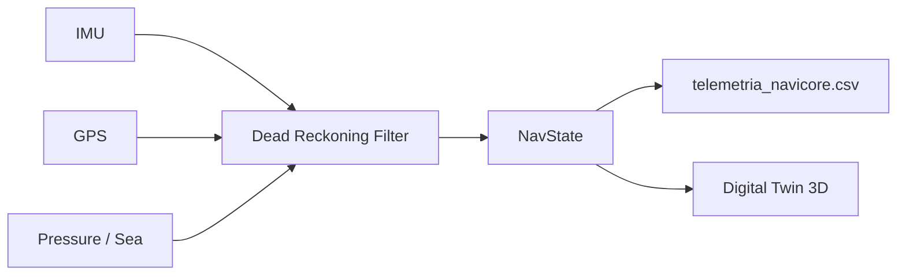

# NaviCore-3D: Multi-Domain Ultra-Low Power Navigation Core

**ES** · Núcleo de navegación unificado multimodal (tierra, aire, mar) diseñado para **edge computing** en microcontroladores de ultra-bajo consumo.  
**EN** · Unified multi-domain navigation core (land, air, sea) built for **edge computing** on ultra-low-power microcontrollers.

---

## Executive Summary / Resumen ejecutivo

| | **English** | **Español** |
|---|---|---|
| **Mission** | Provide a single navigation state model across domains, with dead reckoning when GNSS fails, ready for Ambiq Apollo (Cortex-M + FPU). | Ofrecer un modelo único de estado de navegación en todos los dominios, con navegación estimada cuando falla el GNSS, listo para Ambiq Apollo (Cortex-M + FPU). |
| **Language** | C++17 (PC simulator), embedded-oriented style: fixed structs, no heap. | C++17 (simulador PC), estilo embebido: estructuras fijas, sin heap. |
| **Memory** | **Zero dynamic allocation** in `core/` and `fusion/`: no `std::vector`, no `std::string`, fixed waypoint buffers, stack-only data paths. | **Cero asignación dinámica** en `core/` y `fusion/`: sin `std::vector`, sin `std::string`, buffers fijos, datos en stack. |
| **Math** | `sqrtf` / `sinf` / `cosf` with motion thresholds — skip redundant FPU work when the vehicle is stationary. | `sqrtf` / `sinf` / `cosf` con umbrales de movimiento — se evita trabajo FPU redundante con el vehículo parado. |
| **Coordinates** | Permanent 3D axes: **X = latitude**, **Y = longitude**, **Z = altitude (air) / hydrostatic pressure (sea)**. | Ejes 3D permanentes: **X = latitud**, **Y = longitud**, **Z = altitud (aire) / presión hidrostática (mar)**. |

---

## Architecture / Arquitectura

```
NaviCore-3D/
├── src_pc/                 # PC stress simulator (proves logic before Ambiq port)
│   ├── core/               # NavState, Vector3D, Waypoint — fixed-size types
│   ├── sensors/            # IMU, GPS, pressure simulators
│   ├── fusion/             # Dead reckoning + sensor fusion
│   └── main.cpp            # Stress scenarios + CSV black-box export
├── docs/
│   └── telemetria_navicore.csv   # Digital Twin feed (generated)
└── build/                  # CMake output (local)
```



**NavState** is the single source of truth: position, velocity, heading, mode (`GPS` · `DEAD_RECKONING` · `HYBRID`), and confidence (`estimate_quality`, satellite count, fix age).

---

## Validated Stress Scenarios / Escenarios de estrés superados

Both scenarios run sequentially in `NaviCore3D_Sim` at **100 ms** ticks and export every sample to the black-box CSV.

### 1 · GPS Loss (Air / Land) · Pérdida de GPS (Aire / Tierra)

| | |
|---|---|
| **Setup** | Cruise at **15 m/s**, heading **90°**, **8 satellites** with valid fix. |
| **Event** | At **t = 5 s**, satellites drop to **0** for **10 s**; GNSS updates stop. |
| **Expected** | Mode switches to **`DEAD_RECKONING`**; `estimate_quality` degrades monotonically with `fix_age_ms`; recovery at **t = 15 s**. |
| **Result** | ✅ Quality drops **0.790 → 0.295** during outage; full GNSS recovery after restore. |

### 2 · Submarine Immersion · Inmersión submarina

| | |
|---|---|
| **Setup** | Domain **SEA**, no GNSS; hydrostatic pressure rises at **+10 000 Pa/s**. |
| **Expected** | `Pos_Z` tracks pressure in Pa; `Vel_Z` ≈ **10 000 Pa/s** after first sample. |
| **Result** | ✅ `pos.z` reaches **201 325 Pa** at 10 s; `vel.z` stable at **10 000 Pa/s**. |

---

## Digital Twin 3D · Gemelo Digital 3D

The simulator exports a **black-box telemetry stream** for offline replay, visualization, and ML pipelines — the bridge between embedded firmware and a **3D Digital Twin**.

**File:** `docs/telemetria_navicore.csv` (created on each run)

| Column | Description |
|--------|-------------|
| `Timestamp_ms` | Simulation time [ms] |
| `Escenario` | `GPS_LOSS` or `SUBMARINE` |
| `Modo` | `GPS` · `DEAD_RECKONING` · `HYBRID` · `INITIALIZING` |
| `Calidad` | Confidence score 0.0 – 1.0 |
| `Satelites` | Scenario satellite count |
| `Pos_X` · `Pos_Y` · `Pos_Z` | Unified 3D position (lat °, lon °, alt m or Pa) |
| `Vel_X` · `Vel_Y` · `Vel_Z` | Velocity (m/s north/east/vertical or Pa/s) |
| `Rumbo` | Heading [°] |

Export uses **`fprintf`** — no dynamic allocations inside the simulation loop. Suitable as a reference pattern for SD-card logging on target hardware.

**Next step for the twin:** ingest CSV → time-series database → 3D scene (Cesium, Unity, or Unreal) with mode/confidence colour coding.

---

## Build & Run / Compilar y ejecutar

**Requirements:** CMake ≥ 3.15, C++17 compiler (MinGW, MSVC, or Clang)

```powershell
cd src_pc
cmake -S . -B ../build -G "MinGW Makefiles" -DCMAKE_BUILD_TYPE=Release
cmake --build ../build
../build/NaviCore3D_Sim.exe
```

Console prints stress-test summaries; **`docs/telemetria_navicore.csv`** is written automatically (~302 data rows per run).

---

## Roadmap

| Phase | Target |
|-------|--------|
| **Now** | PC simulator + CSV black box + fusion core hardened |
| **Next** | `src_ambiq/` — Ambiq Apollo4 port, HAL sensors, MRAM-conscious build |
| **Twin** | Live telemetry → Digital Twin 3D dashboard |

---

## License & Author

Private / showcase repository.  
**NaviCore-3D** — *Navigate every domain. Trust every fix. Zero waste on the edge.*
