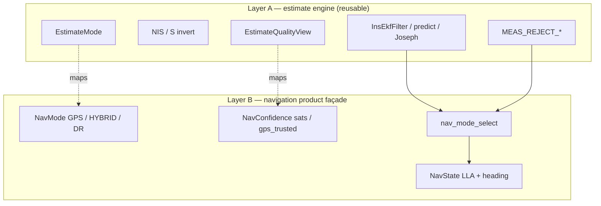

# Estimate engine vs navigation vocabulary

**Goal:** keep the fusion / consistency core reusable as a **generic state estimator with inconsistency detection**. Navigation (LLA, heading, GPS/HYBRID/DR) is one product façade — not the only identity of the code.

This is a **vocabulary + interface split**, not an EKF math rewrite. ABI of `NavState` / `NavConfidence` is unchanged.

---

## Two layers

| Layer | Speaks | Headers |
|-------|--------|---------|
| **A — engine** | state, innovation, reject, quality score, aiding age, AIDED / COAST | `meas_reject.hpp`, `estimate_mode.hpp`, `estimate_quality.hpp`, `ins_ekf_*` |
| **B — nav product** | position LLA, heading, GPS/HYBRID/DR, satellites | `NavState.h`, `nav_mode_policy.*`, `ins_ekf_export_nav_state` |

---

## Mode mapping

| EstimateMode (generic) | NavMode (product ABI) |
|------------------------|------------------------|
| `EST_MODE_UNINITIALIZED` | `NAV_MODE_INITIALIZING` |
| `EST_MODE_AIDED` | `NAV_MODE_HYBRID` |
| `EST_MODE_AIDED_STALE` | `NAV_MODE_GPS` |
| `EST_MODE_COAST` | `NAV_MODE_DEAD_RECKONING` |

Helpers: `estimate_mode_from_nav_mode` / `nav_mode_from_estimate_mode` in `estimate_mode.hpp`.

---

## Reject taxonomy

| Generic | GNSS alias (kept for existing tests) |
|---------|--------------------------------------|
| `MEAS_REJECT_NIS` | `INS_EKF_GNSS_REJECT_NIS` |
| `MEAS_REJECT_S_SINGULAR` | `INS_EKF_GNSS_REJECT_S_SINGULAR` |
| `MEAS_REJECT_INCONSISTENT` | `INS_EKF_GNSS_REJECT_INCONSISTENT` |

Physical inconsistency (`reject_reason=3`) is **IMU-incompatible aiding**, not “navigation-only.”

---

## What not to rename (yet)

- `InsEkfFilter` field names, Joseph / Φ math, wire `NavigationState` packet
- Mass rename of `Nav*` call sites — façade stays for integrators
- Host `fusion.cpp` mode writes (documented parallel path; Pico authoritative via `nav_mode_select`)

---

## Pivot readiness

If a future product needs “estimate + inconsistency” without LLA (e.g. attitude-only, pressure-only, or non-geo state):

1. Consume **Layer A** APIs (`EstimateMode`, `EstimateQualityView`, `MEAS_REJECT_*`, ESKF predict/update).
2. Keep or fork a thin façade like `NavState` for that domain.
3. Do **not** fork the Joseph / NIS core.

See also: [NAV_MODE_DEGRADATION.md](NAV_MODE_DEGRADATION.md).
