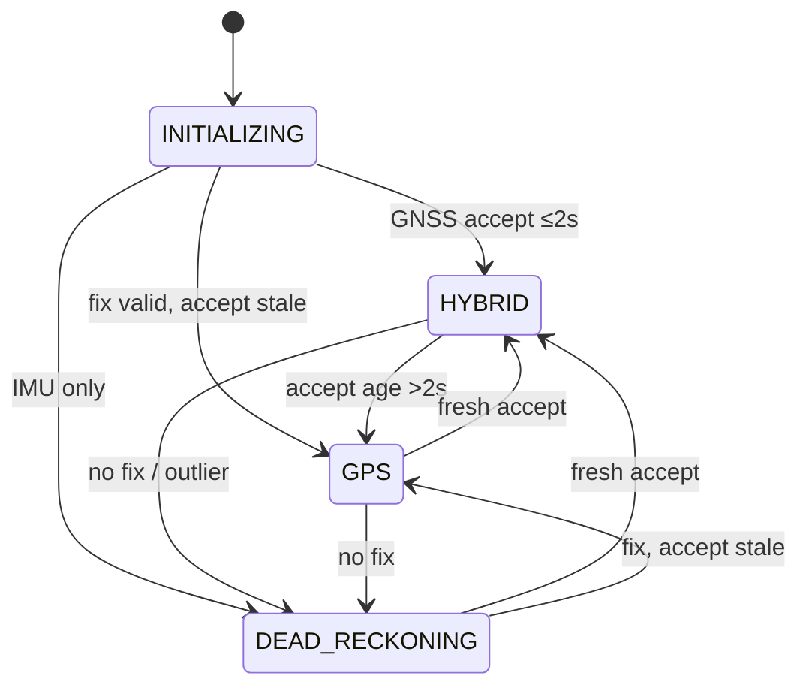

# NavMode degradation matrix (integrator contract)

**Audience:** someone integrating NaviCore into a product who needs to know *when*
modes change and *what precision is (and is not) promised*.

**Normative implementation (Pico / EKF path):** [`src/core/nav_mode_policy.cpp`](../src/core/nav_mode_policy.cpp)
via `ins_ekf_export_nav_state`. Host `fusion.cpp` has a parallel HYBRID/GPS/DR path
for the PC API — see § Host fusion note.

These numbers are **engineering envelopes from published lab artefacts**, not a
certified CEP / DO-229 / aviation integrity level.

---

## Modes

| Mode | Meaning |
|------|---------|
| `INITIALIZING` | Filter not seeded; do not steer on NavState |
| `GPS` | Fix present but last **accepted** GNSS update is older than 2 s (stale accept window) |
| `HYBRID` | Fix present **and** GNSS accepted within last **2 s** — INS + GNSS blended |
| `DEAD_RECKONING` | No usable fix, or GNSS marked outlier / inconsistent — coast on IMU |

Quality field: `NavConfidence.estimate_quality` ∈ [0, 1].  
`gps_trusted` is false in DR / outlier; true in GPS / HYBRID (unless GNSS-degraded overlay).

---

## Transition matrix (EKF / Pico)

| From → To | Trigger | Quality / flags | Precision envelope (honest) |
|-----------|---------|-----------------|----------------------------|
| `*` → `INITIALIZING` | Not seeded | 0 | — |
| `INITIALIZING` → `HYBRID` | First GNSS accept ≤ 2 s window | `0.55 + 0.03×sats` clamp [0.55, 0.95] | Horizontal typically **GNSS-class** while accepting (metres; receiver-dependent) |
| `INITIALIZING` → `GPS` | Fix valid, accept not recent | 0.65 fixed | Treat as **weak GNSS** — do not assume HYBRID coast aid |
| `INITIALIZING` → `DEAD_RECKONING` | IMU running, no fix | age-based `nav_confidence_quality_from_fix_age_ms` | Unseeded / no ref — **unsafe for guidance** |
| `HYBRID` → `GPS` | Fix still valid; accept age > 2 s | 0.65 | Losing fresh aiding — expect drift growth |
| `HYBRID` → `DEAD_RECKONING` | Fix lost **or** consistency/outlier gate | age quality or **0.25** if outlier | Synthetic tunnel MC: **~13 m mean @ 30 s** ([Evidence](../README.md#evidence--published-results)); phone-drive coast with EKF v2: **tens–~110 m** depending on route — **not** rail-grade |
| `GPS` → `HYBRID` | Fresh GNSS accept again | sats formula | Re-anchor |
| `GPS` → `DEAD_RECKONING` | Fix invalid / lost | age quality | Same DR envelope as above |
| `DEAD_RECKONING` → `HYBRID` | GNSS accept within 2 s | sats formula | Reacquire |
| `DEAD_RECKONING` → `GPS` | Fix valid but accept not recent | 0.65 | Partial reacquire |
| Any → quality ×0.5 | UART overflow / IMU silence / IMU cross-check fail / GNSS degrade | overlays mode | Does **not** by itself change mode; lowers trust for mission guards |



---

## Overlay degradations (not NavMode, but trust)

| Event | Effect | Source |
|-------|--------|--------|
| IMU silence ≥ 200 ms | `imu_degraded`, quality ×0.5 | Pico BSP + `health_policy` |
| UART0/1 overflow rate | IMU/GNSS degraded | health_monitor |
| IMU vigilante cross-check fail | `imu_cross_fail`, quality ×0.5 | `imu_cross_check` vs optional MPU-6050 |
| GNSS consistency reject (`reject_reason=3`) | Update dropped; may drive outlier → DR | ESKF |
| Power offline / task starvation | `CRITICAL` (WDT / reboot path) | health_monitor |

---

## Guarantees we **do not** claim

- No SIL / ASIL / DO-178 / ITAR PNT certification.
- No bounded horizontal error for arbitrary coast duration outdoors.
- No RF anti-spoof — software consistency gate only.
- Host `fusion.cpp` mode edges (pressure, wheel odom) are **API/demo** aids; product Pico path is EKF + `nav_mode_select`.

---

## Tests

```powershell
.\build\navicore_unit_tests.exe "[navmode],[imu_cross]"
```

Cases in `tests/unit/test_nav_mode_transitions.cpp` lock the matrix edges and quality formulas.

---

## Host fusion note

`dead_reckoning_update_*` in `fusion.cpp` also sets `HYBRID` / `GPS` / `DEAD_RECKONING` for the PC ingest API (pressure → HYBRID, wheel odom ±quality). Integrators on **Pico** should treat this document’s EKF matrix as authoritative; do not assume fusion overlays exist on-target unless you link that path.
