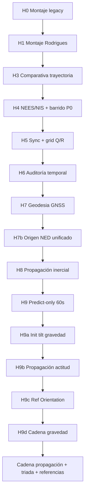

# Metodología y cadena lógica

## Enfoque

El diagnóstico no busca un “bug clásico” (signo invertido, matriz mal puesta). Sigue **reducción por eliminación**:

1. Formular hipótesis acotada y falsificable.
2. Instrumentar el EKF o la cadena de datos **sin cambiar** el comportamiento (salvo flags explícitos de init).
3. Comparar métricas en ventanas temporales (estático / arranque / crucero).
4. Documentar veredicto: refutada, parcial, o abierta.

Cada experimento **H*n*** deja artefactos reproducibles (`*.json`, `*.csv`, `*.png`).

### Validez de runs full-filter (H9 → GAP-3.7)

El replay aplicó ZUPT con **`t ≤ 30 s` OR `gps_speed ≤ 0.1 m/s`** (sin criterio IMU). Todos los experimentos **full-filter** de ese arco están **condicionados** por ese mecanismo hasta repetirse con `--constraint-policy imu_stationary`. Los runs **predict-only** (H9) no están afectados. Regla completa: [11-replay-zupt-provenance.md](11-replay-zupt-provenance.md).

## Cadena lógica H0 → H9d

## Hechos considerados sólidos

### 1. En estático todo cuadra

Con `H9a` (init roll/pitch desde gravedad) y montaje `calibration/imu_mount.json`:

| Métrica | Valor (0–2 s) |
|---------|---------------|
| EKF ↔ Orientation (tilt) | 0.05° |
| EKF ↔ gravedad (`g_body_pred` vs accel) | 0.09° |
| `a_lin,h` | 0.016 m/s² |

Implica que un error **global** de convención (FRD↔FLU, NED↔ENU, `R_bn`/`R_nb` invertida, orden Euler completamente incorrecto) es **poco plausible**: aparecería también en reposo.

### 2. El problema aparece con aceleración longitudinal

- No aparece solo porque pase el tiempo.
- No aparece porque el coche gire (heading longitudinal coherente ~1° en 2–10 s con predict-only).
- Aparece cuando cambia el **régimen dinámico** (pico ~t=6–7 s con aceleración).

### 3. Heading no explica el fenómeno de inclinación

Auditoría `R_bn·e_x` vs bearing GPS: en el tramo crítico 2–10 s, error de heading ≈ **−1.2°** (media), mientras error de inclinación salta ~**4°**.

*Nota:* en crucero con yaw init = 0 (predict-only), el heading global puede divergir (~135°); eso es independiente del salto de inclinación en el arranque.

### 4. Inclinación y aceleración residual van juntas

- `corr(δpitch, a_lin,h) ≈ 0.92` (H9c, dinámica).
- `corr(gravity_angle, a_lin,h) ≈ 1.0` (cadena de propagación).

Correlación no implica causalidad, pero acota el mecanismo a la cadena actitud → proyección → gravedad.

## Lo que no está demostrado

| Afirmación débil | Formulación prudente |
|------------------|----------------------|
| “El EKF pierde inclinación respecto a Android” | “EKF y Orientation **dejan de coincidir** en dinámica” |
| “El culpable es integración roll/pitch” | “La discrepancia **no se explica** solo por error de heading” |
| “Orientation es verdad” | Android fusiona giro + accel + mag con filtros propios; el teléfono puede no estar rígidamente acoplado al vehículo |

Posibilidades aún abiertas: diferencia de **modelo dinámico** entre estimadores, convención Android FLU/ENU vs body EKF, peso del acelerómetro en fusión AHRS vs integración giroscópica pura del EKF.

## Ancla estática

El tramo **0–2 s** es el punto donde Android, acelerómetro y EKF coinciden (~0.05°). A partir de ahí solo se estudia **evolución relativa** respecto a esa ancla, sin re-estimar offsets de montaje.

## Próximo trabajo (sin H10)

1. Auditoría formal de convenciones (`audit_attitude_conventions.py`, `audit_reference_chain.py`).
2. Análisis temporal fino L2 / L5 / L6 en ventana 5–8 s.
3. Solo revisar `ins_ekf.cpp` si la divergencia EKF ↔ Android-gravity persiste en crucero con `a_lin,h` bajo.
