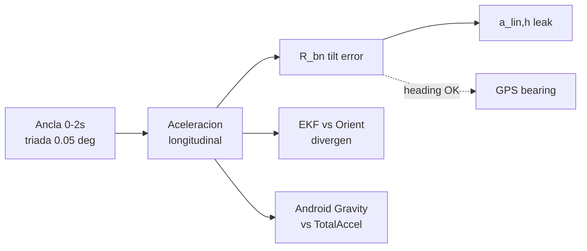

# Investigación de actitud (H9a–H9d)

Bloque final del diagnóstico: aislar por qué `R_bn` desarrolla error de inclinación en régimen dinámico.

## Configuración estándar

```
NaviCore3D_Replay \
  --input docs/benchmarks/real_run_replay.csv \
  --predict-only --predict-only-end-s 60 \
  --h9a-gravity-tilt-init \
  --mount-calibration calibration/imu_mount.json
```

## H9a — Inicialización tilt desde gravedad

**Scripts:** `run_h9a_gravity_init.py`, `run_h9a_gravity_alignment_audit.py`

| Ventana | Error gravedad | `a_lin,h` |
|---------|----------------|-----------|
| Post-init 0–2 s | **0.09°** | 0.016 m/s² |
| 60 s después | ~4.5° | ~0.94 m/s² |

**Veredicto:** La actitud inicial no es la causa raíz. El init colapsa `a_lin,h` al instante pero el error **reaparece** con la dinámica.

---

## H9b — Propagación de actitud

**Script:** `run_h9b_attitude_propagation_audit.py`  
**Flag:** `--h9b-attitude-propagation-audit-csv`

Compara integración giroscópica (`Δθ_integrated`) vs paso observado en vector gravedad (`Δθ_gravity`).

| Ventana | Error gravedad | Δθ_int (media) | Δθ_gravity paso |
|---------|----------------|----------------|-----------------|
| 0–2 s | 0.09° | ~0.0005°/tick | ~0.05°/tick |
| 2–10 s | 4.32° | ~0.01°/tick | ~**1.75°/tick** |

**Veredicto:** No es deriva lenta del giroscopio. Hay un **salto de régimen** cuando el observador por gravedad (accel) deja de ser válido. El giro integrado no explica solo el paso.

---

## H9c — Referencia Orientation.csv

**Script:** `run_h9c_orientation_ref_audit.py`

| Ventana | δ tilt EKF–Orient | `corr(δpitch, a_lin,h)` |
|---------|-------------------|-------------------------|
| 0–2 s | 0.05° | ~0.07 |
| 2–10 s | 4.07° | **0.92** |

**Veredicto:** El EKF **y** Orientation divergen juntos respecto al acelerómetro como “gravedad”. No es solo contaminación del accel: la actitud del filtro se separa de la fusión Android en el mismo régimen.

**Precaución:** Formular como “dejan de coincidir”, no “EKF incorrecto”.

---

## H9d — Cadena de resta de gravedad

**Script:** `run_h9d_gravity_subtraction_audit.py`  
**Flag:** `--h9d-gravity-subtraction-audit-csv`

Descompone: `a_body → R_bn → g_ned → a_lin`

**Veredicto:** La componente horizontal aparece en **`R_bn · a_body`** (`corr = 1.0` con `a_lin,h`). El error no nace en el paso de restar gravedad.

---

## Cadena de propagación completa

**Script:** `run_propagation_chain_audit.py`  
**Flag:** `--propagation-chain-audit-csv`

Etapas registradas por tick: `a_raw`, `a_body`, bias, `a_corr`, `a_nav_body`, `a_nav_corr`, `a_lin`, `g_body_pred`, `g_body_meas`.

**Decisiones:**

| Mecanismo | Resultado |
|-----------|-----------|
| 1 — Actitud `R_bn` | **Sí** |
| 2 — Proyección montaje | No |
| Artefacto bias | No |

---

## Auditoría heading longitudinal

**Script:** `run_rb_forward_heading_audit.py`

`u = R_bn · (1,0,0)` comparado con bearing GPS.

| Ventana | Error heading (media) | Error inclinación |
|---------|----------------------|-------------------|
| 2–10 s | **−1.2°** | ~4.3° |
| Crucero 11–25 s | ~135° | ~3.0° |

En el **onset**, el eje longitudinal apunta bien; el problema es **inclinación**, no heading. En crucero, yaw init = 0 en predict-only explica heading global alto (independiente del salto inicial).

---

## Triada gravitatoria (pred / ref / meas)

**Script:** `run_gravity_triad_audit.py`

En cada tick, tres vectores en body:

| Vector | Origen |
|--------|--------|
| `g_body_pred` | EKF: `R_bn^T · g_ned` |
| `g_body_ref` | Orientation → `R_bn_ref` (offset estático) |
| `g_body_meas` | normalize(`a_corr`) |

Ángulos: pred↔ref, pred↔meas, ref↔meas.

**Separación de mundos:**

- Estático: los tres coinciden (~0.05–0.13°).
- Dinámica: pred↔ref y pred↔meas crecen; ref↔meas también (accel ≠ g).
- `corr(pred↔ref, a_lin,h) ≈ 0.92` en 2–10 s.

---

## Cadena de referencias

**Script:** `audit_reference_chain.py` (también vía `audit_attitude_conventions.py`)

```
Sensor → R_mount → Body → Android → NED → EKF
```

| Eslabón | ¿Constante? | Salto estático→dinámica |
|---------|-------------|-------------------------|
| **L1** R_mount | **Sí** | ~0 |
| **L2** EKF ↔ Android tilt | No | +4.0° |
| **L3** EKF ↔ accel tilt | No | +4.2° |
| **L4** Android ↔ accel | No | +5.8° |
| **L5** Gravity ↔ TotalAccel (Android) | No | +1.8° |
| **L6** Android gravity ↔ EKF body | No | +2.5° |
| **L7** puente convención vs ancla | No* | +4.9° |

\*L7 crece porque divergen los estimadores, no porque la convención FLU/NED falle globalmente (L7 ~0 en estático).

**Hipótesis Android:** `android_separates_gravity_from_total_accel_during_dynamics` — el SO separa gravedad de aceleración total; el EKF (integración giro pura en predict-only) no replica ese comportamiento.

---

## Auditoría de convenciones (sintética)

**Script:** `audit_attitude_conventions.py`

| Test | Resultado |
|------|-----------|
| DCM ortonormal | PASS |
| body ↔ ned inversa | PASS |
| Norma gravedad | PASS |
| quat ↔ DCM | PASS |
| Integración yaw 1°/s | PASS |

La cadena **quat_integrate → quat_to_dcm_bn → body_to_ned** es internamente coherente. Lo pendiente es cruce con convención Android, no inconsistencia obvia intra-EKF.

---

## Diagrama de flujo de evidencia



---

## Artefactos del bloque H9

| Artefacto | Descripción |
|-----------|-------------|
| `h9_predict_only_report.json` | Aislamiento predict |
| `h9b_attitude_propagation_report.json` | Giro vs gravedad |
| `h9c_orientation_ref_report.json` | vs Orientation |
| `h9d_gravity_subtraction_report.json` | Cadena −g |
| `propagation_chain_audit_report.json` | Cadena completa |
| `rb_forward_heading_report.json` | Eje longitudinal |
| `gravity_triad_report.json` | Triada pred/ref/meas |
| `reference_chain_audit.json` | Eslabones L1–L7 |
| `attitude_convention_audit.json` | Tests sintéticos |

Gráficos PNG homónimos en `docs/benchmarks/`.
