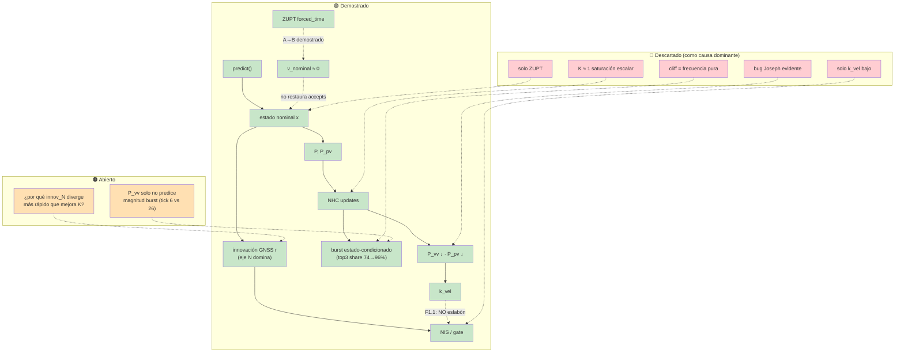

# GAP-3 — Informe de síntesis (estado congelado)

**Estado:** cerrado (2026-07-18) — revisión post-freeze: §3.1 normalización índice B  
**Tipo:** autopsia del filtro actual — Patrón Oro, `data/real_run/`, ~332 s  
**Baseline científico:** `--constraint-policy disabled` (ZUPT OFF), NHC ON salvo Exp E / F1 OFF  
**Auditoría detallada:** [10-gap3-ins-model-audit.md](10-gap3-ins-model-audit.md) (§8.1–§8.18)  
**Provenance ZUPT:** [11-replay-zupt-provenance.md](11-replay-zupt-provenance.md)

> GAP-3 fue una **autopsía**. No modifica Q/R/gains ni propone remedios implementados.  
> Cualquier intervención (GAP-4) debe partir de este modelo causal, no de observaciones aisladas.

---

## 1. Cronología de hipótesis

| Fase | Hipótesis dominante | Qué la refutó / refinó |
|------|---------------------|-------------------------|
| **GAP-3 conceptual** | ¿Bug en Jacobiano / proyección `predict()`? | Prueba D: cadena quat→DCM coherente; `predict()` implementa strapdown estándar |
| **GAP-3.7 / 8.10** | ¿Todo es culpa del ZUPT? | A→B: ZUPT explica **v_nominal≈0**; B→E: quitar ZUPT **no** restaura accepts (7 vs 56) |
| **GAP-3.8–3.11** | ¿NHC comprime P → GNSS rechaza por falta de K? | Autopsia 7 fixes; P_vv colapsa; k_vel cae; árbol NHC→P→GNSS |
| **GAP-3.13–3.14** | ¿Joseph GNSS es el único consumidor de P? | Joseph fix#2 ≈ −31 % P_vv; gap fix#2→#3: Σ\|ΔP\|_NHC ≫ predict; cliff **bursty** |
| **GAP-3.15 F1** | ¿Menos NHC → más P_vv → más accepts? | Dosis-respuesta: P_vv y k_vel suben; **accepts no** (N=10: k_vel×12, accepts=7) |
| **GAP-3.17 F1.1** | ¿El gate es pasivo respecto a K? | Rejects dominados por eje **N**; Λ_N crece; innovación nominal, no K solo |
| **GAP-3.18 F1.2** | ¿Cliff = alta frecuencia NHC? | Decimación mueve el cliff; burst **persiste** (top3 74%→96%); estado-condicionado |

**Patrón:** cada fase partió la cadena anterior y movió el cuello de botella un eslabón aguas abajo.

---

## 2. Nivel A — Demostrado experimentalmente

Resultados que **no dependen** de una interpretación concreta adicional.

| Resultado | Evidencia | Referencia |
|-----------|-----------|------------|
| ZUPT `forced_time` contaminaba el replay | A→B: única diff ZUPT; v_nominal 0→10 m/s | §8.10, doc 11 |
| Quitar ZUPT recupera velocidad nominal | Exp B vs A | §8.10 |
| Quitar ZUPT **no** restaura aceptación GNSS | B: 7 accepts; E: 56 (diff = NHC) | §8.10 |
| NHC controla compresión de P_vv y k_vel | F1: P_vv pre#3 2.5→22→78 (N=1,10,20); k_vel correlacionado | §8.15 |
| Restaurar k_vel **no** restaura accepts | F1 + F1.1: N=10 k_vel=0.09, accepts=7 | §8.15, §8.17 |
| Gate dominado por eje **N** (Λ_N, contrib_N) | Rejects #8–14: contrib_N ≫ contrib_E; \|Λ_N\| monotónico | §8.17 |
| Cliff NHC **estado-condicionado**, no puramente frecuencial | F1.2: cliff tick 3→26; corr(P_pre,\|ΔP\|)=0.70 en N=1; **ver §3.1** para sesgo top3 | §8.18 |
| Joseph GNSS explica **solo parte** de caída P_vv | fix#2: −31 % Joseph; gap: Γ≈19.7 NHC/predict | §8.13, §8.16 |
| Cadena algebraica quat→DCM coherente | Prueba D = 0 | §5.1 |
| NHC ON → 7 accepts vs OFF → 56 | Matriz A–E | §8.10 |

**Métricas mecanísticas disponibles** (reutilizables en GAP-4):

| Métrica | Definición | Uso |
|---------|------------|-----|
| P_vv, P_pv | Frobenius bloques vel / vel-pos | observabilidad |
| k_vel, k_pos | max \|K\| bloque GNSS/NHC | palanca de corrección |
| Γ | Σ\|ΔP_vv\|_NHC / ΣΔP_vv_predict (gap) | balance erosión vs regeneración |
| Λ_i | r_i / √S_ii | componente normalizada del gate |
| NIS, contrib_N/E/D | rᵀS⁻¹r por eje | anatomía del reject |
| top3 share | fracción erosión en 3 ticks NHC | burstiness |
| innov_h | ‖innovación horizontal pos GNSS | estado nominal vs GPS |

---

## 3. Nivel B — Descartado

Hipótesis que **dejaron de ser plausibles** como explicación dominante. No repetir sin nueva evidencia.

| Hipótesis | Por qué descartada |
|-----------|-------------------|
| Bloque **F** ausente o roto en propagación | GAP-3.5–3.6: F·P cross-terms regeneran P_vv; predict +3.2 >> Q blanco |
| Bug algebraico evidente en **Joseph** | GAP-3.14: reproducción bloque fix#2 ~5 % residual |
| **"Todo era culpa del ZUPT"** | B: v≈10 m/s pero 7 accepts; salto 7→56 es NHC |
| **"Todo era culpa de k_vel"** | F1.1: k_vel restaurado (N=10); accepts sin cambio |
| Cliff **puramente frecuencial** | F1.2: decimar NHC mueve timing; magnitud max persiste en N=10 |
| top3 share ↑ con N **como prueba de burst** | **Sesgado** — ver §3.1: N=20 top3=100% es tautología (n_nhc=2) |
| Gate GNSS = consecuencia **pasiva** de P/K baja | F1 partió cadena; F1.1: Λ_N e innov_n dominan |
| Saturación escalar K≈0.99 en cliff | GAP-3.16: K_scalar_z ∈ [0.36, 0.55]; tick 3 NIS≈0.03, \|ΔP\|=28 |
| `forced_time` como baseline científico | A→B + doc 11 |

### 3.1 Sesgo combinatorio del índice B (top3 share) — **corregido post-síntesis**

**No se normalizó en F1/F1.2 originales.** Baseline uniforme: si cada uno de los `n` disparos NHC aportara igual \|ΔP\|, entonces `B_uniform = min(3, n) / n`.

| Policy | N | n_nhc (gap) | top3 raw | B_uniform | top3 / B_uniform | Exceso (raw − uniform) |
|--------|--:|------------:|---------:|----------:|-----------------:|-----------------------:|
| baseline | 1 | 38 | **74.0%** | 7.9% | **9.37×** | +66.1 pp |
| F1a | 2 | 19 | 76.1% | 15.8% | 4.82× | +60.3 pp |
| F1b | 5 | 8 | 80.6% | 37.5% | 2.15× | +43.1 pp |
| F1c | 10 | 4 | 95.7% | 75.0% | **1.28×** | +20.7 pp |
| F1d | 20 | 2 | 100.0% | 100.0% | **1.00×** | +0.0 pp |

**Lectura:** el aumento 74%→96%→100% con N **no** prueba por sí solo burst creciente — N=20 es tautológico (solo 2 eventos). Burst real sigue demostrado en **N=1** (9.4× uniforme) y parcialmente en **N=10** (1.28×). Mecanismo 3: **caracterizado con matiz**, no “top3↑ = más bursty”.

---

## 4. Nivel C — Abierto

**Todavía no cerrado.** El informe debe ser explícito: la flecha causal completa **estado nominal → innovación N → gate** no está demostrada.

### 4.1 Pregunta central abierta

> ¿Por qué el eje **N** del estado nominal diverge lo bastante rápido como para dominar el NIS incluso cuando la observabilidad mecánica (P_vv, k_vel) mejora?

Evidencia que **obliga** esta pregunta:

- F1: N=10 mejora P_vv (22) y k_vel (0.09) vs N=1 — **accepts=7** igual.
- F1.1: primer reject #8; contrib_N domina; \|innov_n\| crece fix#8→#14 mientras S_NN también cae.
- F1.2: tick 6 vs tick 26 (N=10) tienen P_pre≈66 pero \|ΔP\| difiere 15× — P_vv escalar no basta para predecir burst.

### 4.2 Candidatos (no mutuamente excluyentes)

| Candidato | Estado |
|-----------|--------|
| Modelo NHC demasiado restrictivo (v_y, v_z body; v_x libre) | Abierto — no falsificado |
| Interacción **actitud–velocidad** (P_pv, gyro-only attitude) | Abierto — P_pv cae con NHC; no cuantificado vs innov_N |
| Sesgos que sobreviven al accept | Señal secundaria (corr bias_ax, §8.9) |
| Ausencia de observación **longitudinal** / velocidad GNSS | Abierto — posición-only; no es intervención GAP-3 |
| Combinación de los anteriores | Más probable que un único factor |

### 4.3 Residuo predict-only (fuera del gate GNSS)

| Item | Estado |
|------|--------|
| Residuo B (~24 % de \|a_lin,h\| en descomposición A−B) | Abierto — ~1° pitch vs artefacto prueba |
| ¿Strapdown (Modelo A) suficiente para el vehículo? | Abierto — algebra OK; suficiencia operacional no |

---

## 5. Tres mecanismos separados

GAP-3 obliga a **no mezclar** estos caminos al evaluar intervenciones:

```
┌─────────────────────────────────────────────────────────────────┐
│  MECANISMO 1 — Observabilidad / covarianza                      │
│  NHC → P_vv ↓, P_pv ↓ → k_vel ↓                                 │
│  Estado: CARACTERIZADO (F1). Limitante del gate: NO (F1.1)        │
└─────────────────────────────────────────────────────────────────┘

┌─────────────────────────────────────────────────────────────────┐
│  MECANISMO 2 — Estado nominal / innovación GNSS                 │
│  predict → x_nominal → r (innov_N dominante) → NIS → gate       │
│  Estado: CUANTIFICADO (F1.1). Limitante del gate: SÍ              │
│  Flecha causal completa: ABIERTA (§4.1)                           │
└─────────────────────────────────────────────────────────────────┘

┌─────────────────────────────────────────────────────────────────┐
│  MECANISMO 3 — Burst NHC estado-condicionado                    │
│  NHC @ P,P_pv alto → |ΔP| grande (no Riccati suave)              │
│  Estado: N=1 sólido (top3/B_uni≈9×); N=10 parcial; ver §3.1     │
│  No eliminable solo bajando frecuencia (timing sí, magnitud no)   │
└─────────────────────────────────────────────────────────────────┘
```

**Regla para GAP-4:** toda intervención debe declarar cuál mecanismo ataca y cuál **no**.

| Intervención tentativa | M1 obs. | M2 innov. | M3 burst |
|----------------------|:-------:|:---------:|:--------:|
| R_NHC sweep | ✓ | ? | ✓ |
| GNSS velocidad | ? | ✓ | — |
| NHC_MAX_GAIN / GNSS_MAX_GAIN | ✓ | ? | ✓ |
| Decimación NHC (F1) | ✓ | ✗ no gate | parcial M3 |

---

## 6. Diagrama causal final

Leyenda: 🟢 demostrado · 🔴 descartado como explicación dominante · 🟠 abierto



**Cadena que F1 partió experimentalmente:**

| Eslabón | Estado |
|---------|--------|
| NHC → P_vv | 🟢 confirmado |
| P_vv → k_vel | 🟢 confirmado |
| k_vel → accepts | 🔴 **no confirmado** |
| innov_N / Λ_N → gate | 🟢 limitante actual |
| causa raíz innov_N | 🟠 **abierto** |

---

## 7. Números de referencia (Patrón Oro, Exp B)

| Magnitud | N=1 (baseline) | N=10 (F1c) | OFF (E) |
|----------|---------------:|-----------:|--------:|
| GNSS accepts | 7 | 7 | 56 |
| P_vv pre fix#3 | 2.5 | 22.0 | 123.6 |
| k_vel @ fix#3 | 0.008 | 0.092 | 0.256 |
| Γ (gap) | 19.7 | 3.4 | — |
| top3 share NHC | 74 % | 96 % | — |
| innov_h accept mean | 27.2 m | 31.4 m | 7.7 m |
| \|Λ_N\| first reject | 2.34 | 2.28 | 3.27 |

---

## 8. Artefactos clave

| GAP | Script | Output |
|-----|--------|--------|
| 3.8 | `run_gap3_constraint_matrix.py` | `constraint_matrix/` |
| 3.9 | `audit_gap3_nhc_block.py` | `gap3_nhc_block/` |
| 3.10 | `audit_gap3_gnss_accepted_autopsy.py` | `gap3_gnss_accepted_autopsy/` |
| 3.13 | `audit_gap3_fix2_fix3_autoconsume.py` | `gap3_fix2_fix3_autoconsume/` |
| 3.14 | `audit_gap3_fix2_fix3_tick_reconstruction.py` | `gap3_fix2_fix3_tick_reconstruction/` |
| 3.15 F1 | `run_gap3_f1_nhc_dose_response.py` | `gap3_f1_nhc_dose_response/` |
| 3.16 | `audit_gap3_nhc_cliff_mechanism.py` | `gap3_nhc_cliff_mechanism/` |
| 3.17 F1.1 | `audit_gap3_f1_nis_gate_anatomy.py` | `gap3_f1_nis_gate_anatomy/` |
| 3.18 F1.2 | `audit_gap3_f1_cliff_anatomy.py` | `gap3_f1_cliff_anatomy/` |

---

## 9. Puerta a GAP-4

GAP-3 = **autopsia**. GAP-4 = **intervención** — protocolo preregistrado:

**[13-gap4-gnss-velocity-protocol.md](13-gap4-gnss-velocity-protocol.md)**

Incluye: tablas F1/F1.1 como evidencia previa, umbrales de falsación, G2 vel-only, R_vel, instrumentación obligatoria K JSONL. **No implementado.**

### 9.1 No abrir en código hasta fase 4.0 acordada

- Barridos R_NHC / Q — fuera de alcance GAP-4

---

## 10. Historial

| Versión | Fecha | Notas |
|---------|-------|-------|
| 1.0 | 2026-07-18 | Síntesis final GAP-3; niveles A/B/C; diagrama causal; puerta GAP-4 |
