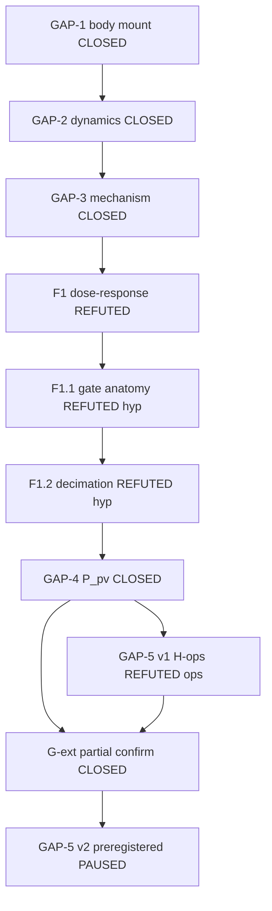
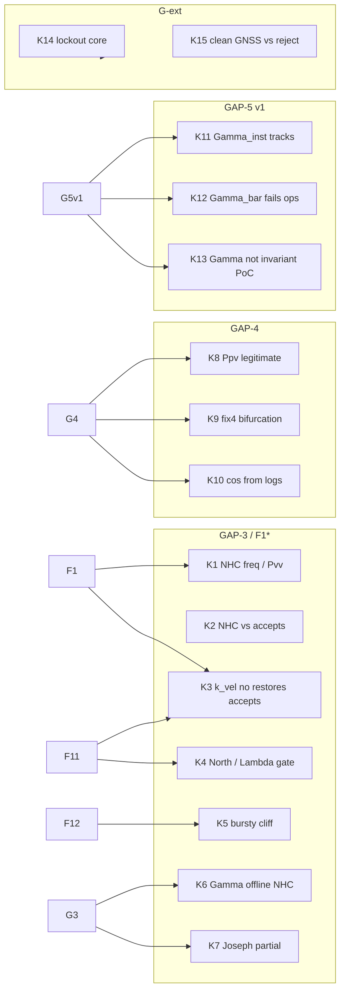
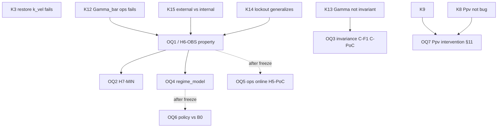

# Dependency Map — Trazabilidad K / fases / OQ

**Tipo:** editorial — comprobar que no hay huecos obvios entre nodos ya congelados.  
**No** propone aristas nuevas de conocimiento.  
**Fecha:** 2026-07-18

---

## 1. Cadena de fases

---

## 2. Conocimiento consolidado → fases

---

## 3. Refutaciones operativas → preguntas abiertas

---

## 4. Decisiones que bloquean reaperturas

| Decisión | Protege |
|----------|---------|
| D2 | No retune R/Q/K como vía primaria |
| D10 | No escribir §17 lessons hasta cierre v2 |
| D12 | No “Norte→longitudinal”; no “G-ext=G1 completo” |
| D13 | No abrir benchmark H6 todavía |

---

## 5. Huecos / tensiones (solo observación)

| Ítem | ¿Hueco? |
|------|---------|
| GAP-1/2 → GAP-3 | Encadenado en doc 09/10; no falta arista documental |
| K9 ↔ G-ext | G-ext **no** alimenta K9 (non-claim explícito) — arista deliberadamente ausente |
| H5-PoC en OQ5 y OQ6 | Misma etiqueta, dos OQ — ambigüedad de nombre (ver CONSISTENCY_AUDIT), no falta de nodo |
| OQ7 vs GAP-5 v2 | Separados por diseño (no mezclar brazos) |

**Conclusión editorial:** no aparece un K huérfano sin fase, ni un OQ de v2 sin precursor en K12/K13/K14/K15. La pausa D13 es el único “siguiente nodo” no ejecutado.
