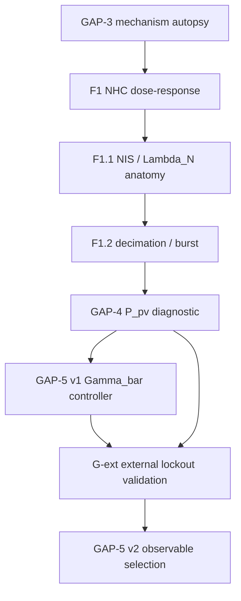

# Research Map

**Tipo:** documentación de referencia — fases, preguntas, outcomes, tags.  
**Regla:** sin cronología narrativa; solo nodos congelados.  
**Última actualización:** 2026-07-18

---

## Flow

---

## Nodes

### GAP-3 — INS/EKF mechanism autopsy

| Campo | Valor |
|-------|-------|
| Question | What compresses covariance and breaks GNSS acceptance? |
| Hypothesis | NHC / predict / Joseph / ZUPT / algebra (sequential partition) |
| Outcome | **Mechanistic model closed** — NHC dominates P; gate nominal-driven |
| Tag | — (synthesis: [12-gap3-synthesis.md](../12-gap3-synthesis.md)) |
| Status | **Closed** |

**Refuted (dominant explanation):** ZUPT-only, k_vel-only, Joseph-only, pure frequency cliff.

---

### F1 — NHC dose–response

| Campo | Valor |
|-------|-------|
| Question | Does less NHC restore P_vv and accepts? |
| Hypothesis | Lower NHC frequency → higher P_vv → more accepts |
| Outcome | **Refuted** — P_vv and k_vel rise; accepts unchanged |
| Evidence | `docs/benchmarks/gap3_f1_nhc_dose_response/` |
| Status | **Closed** |

---

### F1.1 — Gate anatomy

| Campo | Valor |
|-------|-------|
| Question | Is rejection due to low K only? |
| Hypothesis | Restoring K restores accepts |
| Outcome | **Refuted** — North innovation / Λ_N dominates |
| Status | **Closed** |

---

### F1.2 — Decimation / burst persistence

| Campo | Valor |
|-------|-------|
| Question | Is cliff purely high NHC frequency? |
| Hypothesis | Decimation removes burst |
| Outcome | **Refuted** — timing shifts; burst persists; state-conditioned |
| Status | **Closed** |

---

### GAP-4 — P_pv / GNSS velocity diagnostic

| Campo | Valor |
|-------|-------|
| Question | What role does P_pv play at fix#4 and beyond? |
| Hypothesis | P_pv bug vs legitimate coupling vs policy bifurcation |
| Outcome | **Confirmed** — legitimate coupling; fix#4 bifurcates EKF; cos from logs only |
| Tag | `gap4-diagnostic-complete` |
| Doc | [13-gap4-gnss-velocity-protocol.md](../13-gap4-gnss-velocity-protocol.md) |
| Status | **Closed** (diagnostic); §11 intervention **not executed** |

---

### GAP-5 v1 — Adaptive NHC via Γ̄

| Campo | Valor |
|-------|-------|
| Question | Can Γ̄ (EWMA 1 s) drive NHC regime control? |
| Hypothesis | H-ops: preregistered operationalization detects F1 burst |
| Outcome | **Refuted (operationalization)** — Γ̄ inactive; burst not preserved; not threshold tuning issue |
| Tag | `gap5-preregistration-frozen` (prereg); outcome [15-gap5-passive-outcome.md](../15-gap5-passive-outcome.md) |
| PoC active | **Not run** (by design) |
| Status | **Closed** |

**Partial confirm:** Γ_inst ≈ offline Γ in C-F1 (implementation OK).

---

### G-ext — External validation (run 19082026)

| Campo | Valor |
|-------|-------|
| Question | Does the G1 lockout core reappear on an independent trajectory? |
| Outcome | **Partial confirm** — lockout core yes (K14); full G1 causal sequence no; fix#4 region not reached; North dominance not reproduced |
| Strong finding | Clean external GNSS ↔ continuous internal reject (K15) |
| Doc | [INTERPRETATION.md](../../benchmarks/real_run_19082026_baseline/INTERPRETATION.md) |
| Status | **Closed (interpretation frozen)** |
| Role vs GAP-5 v2 | Prerequisite context — two trajectories, shared core, distinct outer behaviour |

---

### GAP-5 v2 — Observable / property selection (H6)

| Campo | Valor |
|-------|-------|
| Question | What internal observable stays coherent when external GNSS quality no longer explains filter behaviour? (formal H6-OBS in protocol §2) |
| Hypothesis | H6-OBS; exploratory H7-MIN (minimal set) |
| Outcome | **Partial regime model** — B1/B2; map R1←O1, R3←O3 provisional, R2 gap, O2 not distinct axis; OQ1 partially open; H7-MIN neither confirmed nor denied |
| Tag | `gap5-v2-observable-preregistration-v1.2` |
| Doc | [16-gap5-v2-observable-selection.md](../16-gap5-v2-observable-selection.md) |
| Closure | [regime_model.md](../../benchmarks/gap5_v2_observable_selection/regime_model.md) · Stage I [STAGE_I_REGIME_IDENTIFICATION_CLOSURE.md](STAGE_I_REGIME_IDENTIFICATION_CLOSURE.md) |
| Status | **Executed — Stage I closed (D21)** |

---

### GAP-5 v3 — Control policies (Stage II — not opened)

| Campo | Valor |
|-------|-------|
| Question | Which control policies are compatible with the Stage I partial regime model? |
| Prerequisite sentence (mandatory when opened) | *GAP-5 v3 no investiga el régimen del filtro. Asume como baseline el modelo parcial obtenido en H6 y estudia exclusivamente políticas de control compatibles con dicho modelo.* |
| Status | **Not opened** |

---

## Legend

| Outcome label | Meaning |
|---------------|---------|
| **Confirmed** | Mechanism or rule in [STATE_OF_KNOWLEDGE.md](STATE_OF_KNOWLEDGE.md) |
| **Refuted** | Hypothesis falsified; do not retry without new preregistration |
| **Refuted (operationalization)** | Methodological — property may exist, this signal/control path does not |
| **Partial** | Evidence supports a bounded claim; full claim not licensed |
| **Not executed / Not opened** | Frozen boundary only |

---

## Related reference docs

- [RESEARCH_METRICS.md](RESEARCH_METRICS.md) — X/Y/Z counts
- [RESEARCH_STATUS.md](RESEARCH_STATUS.md)
- [STATE_OF_KNOWLEDGE.md](STATE_OF_KNOWLEDGE.md)
- [OPEN_QUESTIONS.md](OPEN_QUESTIONS.md)
- [DECISION_LOG.md](DECISION_LOG.md)
